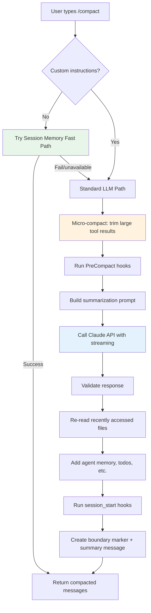

# How Claude Code's `/compact` Command Works

> **Analysis model:** Claude Opus 4.6 (`claude-opus-4-6`) via Claude Code CLI (subscription)\
> **Estimated API cost (reference):** ~$7\
> **Date:** 2026-02-07\
> **Source:** Claude Code npm package, unminified with webcrack + prettier (webcrack names its output `deobfuscated.js` by convention, but the code is minified, not obfuscated)

## Table of Contents

1. [Architecture Overview](#architecture-overview)
2. [Command Definition & Registration](#command-definition--registration)
3. [The Compact Pipeline](#the-compact-pipeline)
4. [The Summarization Prompt](#the-summarization-prompt)
5. [Auto-Compact System](#auto-compact-system)
6. [Session Memory Fast Path](#session-memory-fast-path)
7. [Micro-Compact Pre-Processing](#micro-compact-pre-processing)
8. [Post-Compact Context Restoration](#post-compact-context-restoration)
9. [Hooks System](#hooks-system)
10. [Key Constants](#key-constants)
11. [Environment Variables](#environment-variables)
12. [Summary](#summary)

---

## Architecture Overview



The `/compact` command has **two code paths**:

| Path | When Used | LLM Call? | Speed |
|------|-----------|-----------|-------|
| **Session Memory Fast Path** | No custom instructions + session memory available | No | Instant |
| **Standard LLM Path** | Custom instructions provided, or session memory unavailable | Yes (streaming) | 5-15s |

## Command Definition & Registration

The compact command is registered as a **`type: "local"`** command (not `"prompt"` or `"local-jsx"`).

**Source:** `deobfuscated.js:554406`

```js
{
  type: "local",
  name: "compact",
  description: "Clear conversation history but keep a summary in context. Optional: /compact [instructions for summarization]",
  isEnabled: () => !isTruthy(process.env.DISABLE_COMPACT),
  isHidden: false,
  supportsNonInteractive: true,
  argumentHint: "<optional custom summarization instructions>",
  load: () => Promise.resolve().then(() => { initCompactModule(); return compactModule; }),
  userFacingName() { return "compact"; },
}
```

Key properties:
- **`type: "local"`** — The command runs locally (not sent as a prompt to the LLM). Its `call` export is invoked directly.
- **`isEnabled`** — Disabled if `DISABLE_COMPACT` env var is truthy.
- **`argumentHint`** — Shows in the UI that you can pass custom instructions.
- **`load`** — Lazy-loads the compact module, which exports `{ call: compactEntryPoint }`.

### How `type: "local"` Commands Are Dispatched

When the user submits `/compact [args]`, the dispatch function (`NGY` at line 467216) matches on `O.type`:

```js
case "local": {
  let result = await (await command.load()).call(args, toolUseContext);
  if (result.type === "compact") {
    // Special handling: replace entire conversation with compacted messages
    let assembled = assembleCompactedMessages({ ...result.compactionResult, messagesToKeep: [...] });
    return { messages: assembled, shouldQuery: false };
  }
  // ... other result types
}
```

The `"compact"` return type is specially handled — it **replaces the entire message history** with the compacted output. This is unique to compact; other local commands just append their output.

---

## The Compact Pipeline

### Entry Point (`compactEntryPoint` — line 554320)

```
compactEntryPoint(userArgs, context)
  ├── if no custom instructions → try sessionMemoryCompact() [fast path]
  ├── microCompactMessages()  [trim large tool results]
  ├── performCompaction()     [main pipeline]
  │   ├── runPreCompactHooks()
  │   ├── buildSummarizationPrompt(customInstructions)
  │   ├── callCompactionLLM()  [streaming API call]
  │   ├── validate response (no text? API error? prompt too long?)
  │   ├── restoreRecentFiles()
  │   ├── getAgentMemory(), getTodoContext()
  │   ├── runLifecycleHooks("compact")
  │   └── assemble result
  └── return { type: "compact", compactionResult, displayText }
```

### Step-by-Step

1. **Track usage** — `Q4("compact")` records telemetry for the compact command.

2. **Fast path attempt** — If no custom instructions, tries `nG6()` (session memory compact). If it returns a result, skip the LLM call entirely.

3. **Micro-compact** — `Ym()` pre-processes messages by shrinking large tool results. Tool results from "compactible tools" (Read, Bash, etc.) that are old and large get replaced with file references like `"Tool result saved to: /path"`. This reduces the token count before the summarization call.

4. **Build context** — `XdY()` assembles the system prompt, user context (CLAUDE.md etc.), and system context for the fork.

5. **Perform compaction** (`sj1()` — line 531497):
   - Count pre-compact tokens
   - Run **PreCompact hooks** (user can inject custom instructions via hooks)
   - Build the summarization prompt with `LHA(customInstructions)`
   - Make the **streaming API call** via `nn4()`
   - Validate the response text
   - **Re-read recently accessed files** to preserve them in the new context
   - Add agent memory, todo context
   - Run **lifecycle hooks** with the `"compact"` event (analogous to session start)
   - Calculate token metrics and create the boundary marker

6. **Clean up** — Clear caches, reset state, return the result.

---

## The Summarization Prompt

The compaction call has two parts:

**System prompt** (`deobfuscated.js:531890`):
```
"You are a helpful AI assistant tasked with summarizing conversations."
```

**User prompt** (`deobfuscated.js:275292`, function `LHA`):

A detailed prompt asking for a structured summary with these sections:

1. **Primary Request and Intent** — What the user asked for
2. **Key Technical Concepts** — Technologies and frameworks discussed
3. **Files and Code Sections** — Files examined/modified with code snippets
4. **Errors and Fixes** — Errors encountered and how they were resolved
5. **Problem Solving** — Problems solved and ongoing troubleshooting
6. **All User Messages** — Every non-tool-result user message (critical for preserving intent)
7. **Pending Tasks** — Tasks explicitly asked to work on
8. **Current Work** — Precise description of what was being done right before compaction
9. **Optional Next Step** — Next step with **direct quotes** from recent conversation

The prompt explicitly asks for:
- `<analysis>` tags for the LLM's reasoning process
- `<summary>` tags for the actual summary
- **No tool use** — "IMPORTANT: Do NOT use any tools"
- Technical precision — file names, full code snippets, function signatures

If the user provides custom instructions (e.g., `/compact focus on test output`), they're appended as:
```
Additional Instructions:
focus on test output
```

### Partial Compact Prompt

There's also a separate prompt for **partial compaction** (`rv7` at line 275207) that only summarizes *recent* messages while keeping earlier retained context intact.

### Post-Processing

The LLM's response is processed by:
1. `cleanSummaryXML()` — Strips `<analysis>` and `<summary>` tags, converts to plain text
2. `formatSummaryForContinuation()` — Wraps the summary in a continuation message:

```
This session is being continued from a previous conversation that ran out of context.
The summary below covers the earlier portion of the conversation.

[cleaned summary text]

If you need specific details from before compaction, read the full transcript at: [path]
```

---

## Auto-Compact System

Claude Code can automatically compact when the context is getting full.

**Source:** `deobfuscated.js:533083-533144`

### How Thresholds Work

```
Context Window (e.g., 200K tokens)
├── Reserved tokens (model-specific)
├── Effective window = context window - reserved
├── Auto-compact threshold = effective window - 13000
├── Warning threshold = effective window - 20000
├── Error threshold = effective window - 20000
└── Blocking limit = context window - 3000
```

| Threshold | Formula | Effect |
|-----------|---------|--------|
| **Auto-compact** | `effectiveWindow - 13000` | Triggers automatic compaction |
| **Warning** | `effectiveWindow - 20000` | Shows warning indicator |
| **Error** | `effectiveWindow - 20000` | Shows error indicator |
| **Blocking** | `contextWindow - 3000` | Blocks further input |

### Controls

- `process.env.DISABLE_COMPACT` — Disables compact entirely
- `process.env.DISABLE_AUTO_COMPACT` — Disables auto-compact only
- `process.env.CLAUDE_AUTOCOMPACT_PCT_OVERRIDE` — Override auto-compact threshold as percentage (e.g., "80" = 80%)
- `process.env.CLAUDE_CODE_BLOCKING_LIMIT_OVERRIDE` — Override blocking limit
- `settings.autoCompactEnabled` — User setting toggle

### Auto-Compact Guard

Auto-compact is **skipped** when the `querySource` is `"session_memory"` or `"compact"` — preventing recursive compaction.

---

## Session Memory Fast Path

**Source:** `deobfuscated.js:533001` (function `nG6`)

This is a **zero-LLM-call** compaction path that uses a stored session memory template:

1. Check if session memory is enabled (`iG6()`)
2. Load session memory state
3. Get the last summarized message ID and the session memory template
4. Find the split point — messages before this point are already summarized
5. Extract recent messages (after the split)
6. Build the compacted message list using the template + recent messages
7. Count tokens — if still above threshold, fall back to LLM path

This path is only attempted when:
- No custom summarization instructions are provided
- Session memory feature is enabled
- A valid session memory template exists and is non-empty

---

## Micro-Compact Pre-Processing

**Source:** `deobfuscated.js:532598` (function `Ym`)

Before the main compaction, large tool results are **shrunk** to save tokens:

1. Identify tool_use/tool_result pairs from "compactible" tools (Read, Bash, etc.)
2. Keep the most recent N tool results intact
3. For older ones: save the full content to a file, replace the tool_result with a reference like `"Tool result saved to: /path\n\nUse Read to view"`
4. Only actually compact if above the warning threshold (unless explicit target)

Controlled by `process.env.DISABLE_MICROCOMPACT`.

---

## Post-Compact Context Restoration

After the LLM generates a summary, several pieces of context are **restored** to the new conversation:

| What | How | Why |
|------|-----|-----|
| **Recently read files** | Re-read top N files by recency | Preserves file context for next turns |
| **Agent memory** | `getAgentMemory(agentId)` | Persistent agent memory across sessions |
| **Agent context** | `getAgentContextMessage(agentId)` | Agent-specific context |
| **Todo list** | `getTodoContext()` | Preserves task tracking |
| **Lifecycle hooks** | `runLifecycleHooks("compact")` | Custom post-compact setup |

The final message list is:
```
[compact_boundary_marker, summary_message, ...messagesToKeep, ...attachments, ...hookResults]
```

---

## Hooks System

### PreCompact Hook

**Event:** `PreCompact`
**Trigger values:** `"manual"` (user ran `/compact`) or `"auto"` (auto-compact)

Hook output can:
- **Inject additional summarization instructions** — Successful hook output is appended to the custom instructions
- **Show a display message** — Shown to the user after compaction

### Post-Compact Lifecycle Hook

After compaction, **lifecycle hooks** run with the `"compact"` event, since compaction effectively creates a "new session" from the LLM's perspective.

---

## Key Constants

| Constant | Value | Purpose |
|----------|-------|---------|
| `MAX_COMPACT_OUTPUT_TOKENS` | 20,000 | Max tokens for the compact LLM response |
| `AUTO_COMPACT_RESERVE` | 13,000 | Token reserve before auto-compact triggers |
| `WARNING_THRESHOLD_OFFSET` | 20,000 | Offset from effective window for warning |
| `BLOCKING_LIMIT_OFFSET` | 3,000 | Offset from context window for hard block |
| `minTokens` | 10,000 | Min tokens for compact config |
| `minTextBlockMessages` | 5 | Min text block messages for compact |
| `maxTokens` | 40,000 | Max tokens for compact config |

---

## Environment Variables

| Variable | Effect |
|----------|--------|
| `DISABLE_COMPACT` | Disables `/compact` entirely |
| `DISABLE_AUTO_COMPACT` | Disables automatic compaction |
| `DISABLE_MICROCOMPACT` | Disables pre-processing of large tool results |
| `CLAUDE_AUTOCOMPACT_PCT_OVERRIDE` | Override auto-compact threshold (percentage) |
| `CLAUDE_CODE_BLOCKING_LIMIT_OVERRIDE` | Override the hard blocking limit |

---

## Summary

The `/compact` command is a sophisticated context management system that:

1. **Tries the fast path first** — Session memory can skip the LLM call entirely
2. **Pre-processes messages** — Large tool results are saved to files and replaced with references
3. **Runs hooks** — Users can inject custom summarization instructions via PreCompact hooks
4. **Calls Claude** — With a detailed 9-section summarization prompt, max 20K output tokens, thinking disabled, tool use denied
5. **Restores context** — Re-reads recently accessed files, adds agent memory, todos
6. **Replaces the conversation** — The entire message history becomes: boundary marker + summary + preserved messages + attachments + hook results
