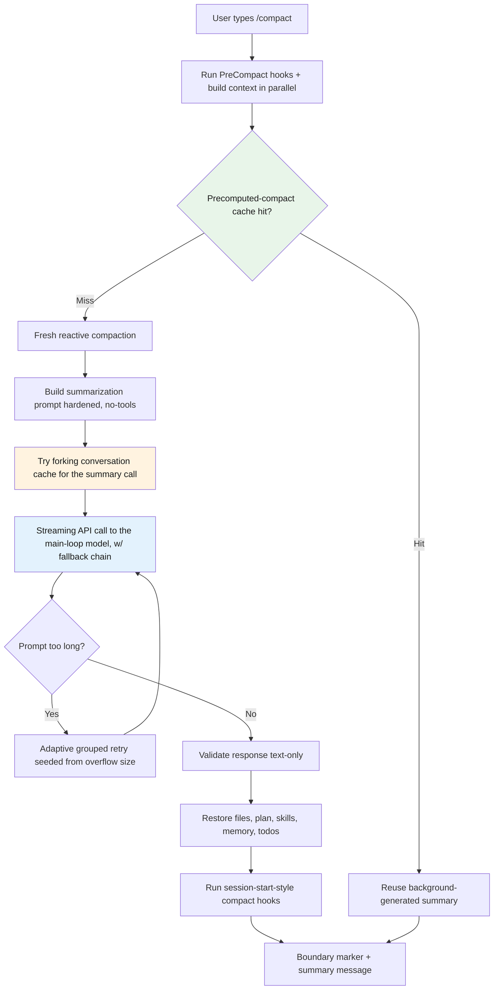

# How Claude Code's `/compact` Command Works

> **Analysis model:** Claude Fable 5 (`claude-fable-5`) via Claude Code CLI\
> **Date:** 2026-07-04\
> **Source:** Claude Code v2.1.201, extracted from the Bun standalone binary, unminified with webcrack (`--no-jsx`) + prettier\
> **Annotated files:** `compact-annotated.js`\
> **Build:** `2.1.201`, git `5bb45156`, built `2026-07-03`

> **What changed since the 2.1.34 analysis:** `/compact` is the deep dive that evolved the most. The single self-contained module is gone — the feature is now spread across several clusters. The **session-memory fast path was removed** and replaced by a background **precompute/borrow** system. The summarization prompt was **hardened against prompt injection**. There is a new **`/autocompact`** command, a **circuit breaker**, a **thrashing detector**, and **compact prompt-cache sharing**. Each of these is called out in [How this evolved](#how-this-evolved-since-2134). The read on *why*: every change points at making auto-compaction cheaper, safer, and less likely to loop — compaction moved from a user-triggered action to a mostly-invisible background system that has to be robust on its own.

## Table of Contents

1. [Architecture Overview](#architecture-overview)
2. [Where the Code Lives](#where-the-code-lives)
3. [Command Definition & Dispatch](#command-definition--dispatch)
4. [The Compact Pipeline](#the-compact-pipeline)
5. [The Summarization Prompt](#the-summarization-prompt)
6. [Auto-Compact, Precompute & Thresholds](#auto-compact-precompute--thresholds)
7. [Circuit Breaker & Thrashing Detector](#circuit-breaker--thrashing-detector)
8. [Reactive Micro-Compaction](#reactive-micro-compaction)
9. [Post-Compact Context Restoration](#post-compact-context-restoration)
10. [Hooks System](#hooks-system)
11. [Key Constants](#key-constants)
12. [Environment Variables](#environment-variables)
13. [How this evolved since 2.1.34](#how-this-evolved-since-2134)

---

## Architecture Overview


```mermaid
flowchart TD
    A[User types /compact] --> B[Run PreCompact hooks + build context in parallel]
    B --> C{Precomputed-compact cache hit?}
    C -->|Hit| D[Reuse background-generated summary]
    C -->|Miss| E[Fresh reactive compaction]
    E --> F[Build summarization prompt hardened, no-tools]
    F --> G[Try forking conversation cache for the summary call]
    G --> H[Streaming API call to the main-loop model, w/ fallback chain]
    H --> I{Prompt too long?}
    I -->|Yes| J[Adaptive grouped retry seeded from overflow size]
    J --> H
    I -->|No| K[Validate response text-only]
    K --> L[Restore files, plan, skills, memory, todos]
    L --> M[Run session-start-style compact hooks]
    M --> N[Boundary marker + summary message]
    D --> N

    style C fill:#e8f5e9,color:#1a1a1a
    style G fill:#fff3e0,color:#1a1a1a
    style H fill:#e3f2fd,color:#1a1a1a
```

The key mental-model shift from 2.1.34: compaction is no longer "try to skip the LLM call." The LLM call is assumed necessary — the optimization is that **it may already have run in the background** before you (or auto-compact) ask for it.

## Where the Code Lives

At 2.1.34 the whole feature sat in one `v(() => {...})` module. In 2.1.201 it is spread across clusters that share helpers:

| Cluster | Lines (`deobfuscated.js`) | Contents |
|---------|---------------------------|----------|
| Command registration | 647519–647920 | `/compact` and the new `/autocompact` |
| Prompt text + legacy full-compact | 400760–402770 | Summarization prompts, legacy compactor, cache-sharing API call |
| Reactive / precompute engine | 402608–404200 | Grouped adaptive retry compactor (from ~402608) + precompute cache (403200+) |
| Auto-compact thresholds + breaker | 619860–620530 | Threshold math, circuit breaker, thrash detector |
| Reactive micro-clear | 597188–597290, 615914–616029 | `context_hint`-reject driven tool-result clearing |
| PreCompact hook runner | 627034–627070 | Hook payload assembly |
| Post-compact restore | 402207–402300+ | Files, plan, skills, todos, memory |

## Command Definition & Dispatch

`/compact` is still a **`type: "local"`** command (`deobfuscated.js:647811`):

```js
{
  type: "local",
  name: "compact",
  description: "Free up context by summarizing the conversation so far", // changed wording
  isEnabled: () => !DISABLE_COMPACT,
  supportsNonInteractive: true,
  argumentHint: "<optional custom summarization instructions>",
  thinClientDispatch: "post-text",   // new: generic thin-client routing tag (8 commands carry "post-text")
  load: () => Promise.resolve().then(() => { initCompactModule(); return compactModule; }),
}
```

Differences from 2.1.34: the description changed from *"Clear conversation history but keep a summary in context…"* to *"Free up context by summarizing the conversation so far"*, `isHidden: false` is gone, and a `thinClientDispatch: "post-text"` field was added (not compact-specific — it tags how thin clients route the command).

Dispatch is unchanged in shape: the `"local"` handler calls `(await command.load()).call(args, ctx)`, and a `"compact"` return type **replaces the entire message history** with the compacted output — still unique to compact among local commands.

### New sibling: `/autocompact`

A new command registered right after compact (`deobfuscated.js:648280`+) lets the user configure the auto-compact window directly. It has two variants — an interactive `local-jsx` slider UI and a non-interactive `local` variant — and both write the auto-compact window setting (`/autocompact [auto|<tokens>]`), surfaced as "auto", a token count, or "from `CLAUDE_CODE_AUTO_COMPACT_WINDOW`" / "from settings".

## The Compact Pipeline

```
manualCompactEntry(userArgs, ctx)
  ├── runPreCompactHooks()  ┐  (run in parallel)
  ├── buildForkContext()    ┘
  ├── checkPrecomputedCompactCache()
  │     ├── HIT  → reuse the background-generated compaction result
  │     └── MISS → freshReactiveCompaction()
  │                 ├── buildSummarizationPrompt(customInstructions)
  │                 ├── tryForkConversationCache()   [prompt-cache sharing]
  │                 ├── streamingCompactionCall()      [main-loop model + fallback chain]
  │                 ├── adaptiveGroupedRetry()         [on prompt-too-long / media-too-large]
  │                 ├── validate (text only)
  │                 └── restoreContext()               [files, plan, skills, memory, todos]
  └── return { type: "compact", compactionResult, displayText }
```

The old **session-memory fast path** (a zero-LLM template-based skip, `nG6` in the 2.1.34 analysis) no longer exists — an exhaustive search for a template-skip mechanism found nothing. It was replaced by the precompute/borrow system: auto-compaction can run the summarization LLM call *in the background* before the context is actually full, cache the result (7-day TTL), and a later `/compact` or auto-compact trigger simply reuses it if it's still fresh.

## The Summarization Prompt

**System prompt** (`deobfuscated.js:402099`) — unchanged verbatim:

```
You are a helpful AI assistant tasked with summarizing conversations.
```

**User prompt** (`deobfuscated.js:400873`, function renamed `buildSummarizationPrompt`) — the same 9 sections as 2.1.34 (Primary Request and Intent, Key Technical Concepts, Files and Code Sections, Errors and fixes, Problem Solving, All user messages, Pending Tasks, Current Work, Optional Next Step), but with two significant additions:

**1. Prompt-injection hardening.** The tool-refusal language is now much stronger and, critically, positioned to survive user-supplied custom instructions (`deobfuscated.js:400874`):

```
CRITICAL: Respond with TEXT ONLY. Do NOT call any tools.

- Do NOT use Read, Bash, Grep, Glob, Edit, Write, or ANY other tool.
- You already have all the context you need in the conversation above.
- Tool calls will be REJECTED and will waste your only turn — you will fail the task.
- Your entire response must be plain text: an <analysis> block followed by a <summary> block.
```

A reminder is also appended **after** any user-supplied custom instructions (`deobfuscated.js:400984`), specifically so injected instructions can't override the no-tools rule.

**2. Security-instruction preservation** (`deobfuscated.js:400897`, reinforced in section 6 at `400907`):

```
Note any security-relevant instructions or constraints the user stated (e.g., sensitive
files or data to avoid, operations that must not be performed, credential or secret handling
rules). These MUST be preserved verbatim in the summary so they continue to apply after
compaction.
```

This closes a real gap: without it, a summary could silently drop a "never touch prod" or "don't read `.env`" instruction, and the post-compaction agent would resume without that constraint.

There are three prompt variants — the full prompt (`W9n`), a recent-only prompt for partial/"summarize up to here" compaction (`DKp`), and a partial "up_to" prompt — all carrying the same hardening.

## Auto-Compact, Precompute & Thresholds

The classic threshold math is intact (`deobfuscated.js:619878`):

| Threshold | Formula | Effect |
|-----------|---------|--------|
| **Auto-compact** | `effectiveWindow − 13000` | Triggers automatic compaction |
| **Warning** | `effectiveWindow − 20000` | Warning indicator |
| **Blocking** | `contextWindow − 3000` | Hard input block |

New on top of this: a per-model/surface **`precomputeBufferFraction`** can trigger the background precompute *earlier* than the −13000 mark, so the summary is ready before the hard trigger. The precomputed result is cached with a **7-day TTL** (`deobfuscated.js:403713`).

Incidental find while tracing this: the model context table for `claude-sonnet-5` (`deobfuscated.js:620223`) sets a default window of **967,000 tokens**, with `remote_cowork` and `local-agent` surfaces capped at 500,000 — a concrete artifact of Sonnet 5's native 1M context landing as the default model in this window.

## Circuit Breaker & Thrashing Detector

Two independent safety mechanisms were added — both are *new since 2.1.34* and both exist because auto-compaction now runs unattended:

- **Circuit breaker** (`deobfuscated.js:620266`): after **3 consecutive** auto-compact failures it trips, logs *"autocompact: circuit breaker tripped after N consecutive failures… skipping future attempts this session"*, fires `tengu_auto_compact_circuit_breaker`, and stops trying for the session.
- **Thrashing detector** (`deobfuscated.js:620238`): distinct from the breaker — if the context refills to the limit within 3 turns of the previous compact, **3 times in a row**, it shows a user-facing message: *"Autocompact is thrashing: the context refilled to the limit within 3 turns of the previous compact, 3 times in a row. A file being read or a tool output is likely too large for the context window. Try reading in smaller chunks, or use /clear to start fresh."*

Retry logic also became adaptive. The legacy full-compact path keeps a fixed cap of **3** prompt-too-long retries (dropping the oldest ~20% each time). The reactive grouped compactor (`deobfuscated.js:402608`) has no fixed cap — it seeds its first drop-step from the **actual token overflow** (rather than starting minimal), then recomputes each subsequent step from the reported `tokenGap`, and terminates on success, group exhaustion, or unstrippable media. It also retries once with media stripped on a `media_too_large` failure.

## Reactive Micro-Compaction

The old size-based micro-compact that ran at the *start* of `/compact` (2.1.34's `Ym`) is no longer called from the manual path, and **`DISABLE_MICROCOMPACT` no longer exists** (zero occurrences in the 965K-line source). What replaced it is a separate, feature-flag-gated (`tengu_hazel_osprey`) mechanism that fires **reactively** when the server rejects a request with a `context_hint` (HTTP 422/424, telemetry `tengu_context_hint_reject`): it clears old tool results to `"[Old tool result content cleared]"`, or persists large ones to disk and replaces them with:

```
Tool result saved to: ${filepath}

Use Read to view
```

(wrapped in `<persisted-output>` tags). This is driven by the server telling the client it's over budget, not by the client pre-trimming — a more precise trigger than the old heuristic.

## Post-Compact Context Restoration

After the summary is produced, several pieces of context are restored (`deobfuscated.js:402207`):

| What | How | New since 2.1.34? |
|------|-----|-------------------|
| Recently-read files | Re-read top files by recency, capped per-file and in aggregate | No |
| Agent memory / context | Memory functions | No |
| Todo list | Todo restore | No |
| **Plan-mode file** | `plan_file_reference` restore (`402263`) | **Yes** |
| **Recently-invoked skills** | Skill content restore, token-budget capped (`402275`) | **Yes** |
| Lifecycle hooks | Session-start-style hooks run with the `"compact"` event | No |

The two new restorations (plan file, skills) exist because Plan mode and the Skills system both postdate the original analysis.

## Hooks System

**PreCompact hook** (`deobfuscated.js:627034`) — unchanged shape:

```js
{ hook_event_name: "PreCompact", trigger: "manual" | "auto", custom_instructions: ... }
```

Fired from both the legacy full-compact path and the manual entry point. Hook output can inject additional summarization instructions and show a display message. After compaction, session-start-style lifecycle hooks run with the `"compact"` event, since compaction effectively begins a "new session" from the model's perspective.

## Key Constants

| Constant | Value | Line | Purpose |
|----------|-------|------|---------|
| Auto-compact reserve | 13,000 | 619879 | `effectiveWindow − 13000` = auto-compact trigger |
| Warning offset | 20,000 | 619892 | `effectiveWindow − 20000` = warn level |
| Blocking reserve | 3,000 | 619894 | `contextWindow − 3000` = hard block |
| Legacy PTL retry cap | 3 | 402394 | Max prompt-too-long retries (legacy path) |
| Legacy PTL drop fraction | 0.2 | 401346 | Oldest fraction dropped per legacy retry |
| Circuit-breaker trip count | 3 | 620526 | Consecutive failures before breaker trips |
| Thrashing trip count | 3 | 620261 | Rapid-refill events before thrash warning |
| Precompute cache TTL | 7 days | 403713 | Precomputed-compact cache lifetime |
| `MAX_COMPACT_OUTPUT_TOKENS` | **not found** | — | The 2.1.34 constant (20,000) could not be located under any name in current source; the compact call now passes a generic per-model max-output config. Treat as removed/unverified. |

## Environment Variables

| Variable | Status | Effect |
|----------|--------|--------|
| `DISABLE_COMPACT` | present | Disables `/compact` entirely |
| `DISABLE_AUTO_COMPACT` | present | Disables automatic compaction |
| `CLAUDE_AUTOCOMPACT_PCT_OVERRIDE` | present | Override auto-compact threshold (percentage) |
| `CLAUDE_CODE_BLOCKING_LIMIT_OVERRIDE` | present | Override the hard blocking limit |
| `CLAUDE_CODE_AUTO_COMPACT_WINDOW` | **new** | Set the auto-compact window (also settable via `/autocompact`) |
| `DISABLE_MICROCOMPACT` | **removed** | No longer exists — the micro-compact it gated moved to the reactive `context_hint`-reject mechanism |

## How this evolved since 2.1.34

| Change | 2.1.34 | 2.1.201 | Likely why |
|--------|--------|---------|------------|
| **Fast path** | Zero-LLM session-memory template skip | Removed; replaced by background **precompute/borrow** (LLM runs ahead of time, result cached 7d) | A template skip is brittle; precomputing the real summary is both accurate and, in the good case, invisible |
| **Prompt safety** | "IMPORTANT: Do NOT use any tools" | Hardened CRITICAL block + reminder placed *after* custom instructions + verbatim security-instruction preservation | Compaction became an injection surface and a place where safety constraints could silently drop |
| **Robustness** | Fixed retry cap | Circuit breaker (3 fails) + thrashing detector (3 rapid refills) + overflow-seeded adaptive retry | Auto-compaction now runs unattended and must fail safe instead of looping |
| **Cost** | Full-context summarization call | **Prompt-cache sharing**: forks the conversation cache for the summary call (`tengu_compact_cache_prefix`) | Avoids paying full input cost to summarize context the cache already holds |
| **Micro-compact** | Client-side pre-trim, `DISABLE_MICROCOMPACT` | Reactive, server-`context_hint`-driven, flag-gated | Trim exactly when the server says you're over, not on a client heuristic |
| **Config surface** | Env vars only | New `/autocompact` command + `CLAUDE_CODE_AUTO_COMPACT_WINDOW` | Auto-compaction became prominent enough to deserve a first-class control |
| **Restoration** | Files, memory, todos | + Plan-mode file + recently-invoked skills | New subsystems (Plan mode, Skills) that postdate 2.1.34 |

The throughline: at 2.1.34, `/compact` was a user-invoked command that tried to avoid an LLM call. By 2.1.201 it is the visible tip of a mostly-automatic, background context-management system that assumes the LLM call, tries to have it done ahead of time, shares cache to make it cheap, and wraps the whole thing in breakers so it can run without a human watching.
