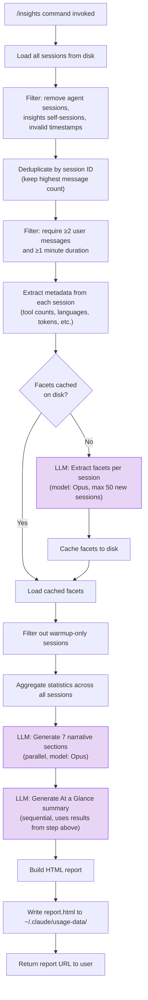

# How Claude Code's `/insights` Command Works

> **Analysis model:** Claude Opus 4.6 (`claude-opus-4-6`) via Claude Code CLI (subscription)
> **Date:** 2026-02-07
> **Source:** Claude Code npm package v2.1.34, unminified with webcrack + prettier

Claude Code ships with a `/insights` command that analyzes your past sessions and generates an HTML report about how you use it — what you work on, where things go wrong, what to try next. It's one of the more unusual features in an AI coding tool: the AI reads its own session logs, has another AI extract structured data from each one, aggregates the results, then has yet another set of AI calls write narrative sections about your usage patterns.

This post documents exactly how that pipeline works, based on reading the source code directly.

---

## Table of Contents

- [How the source was obtained](#how-the-source-was-obtained)
- [Architecture overview](#architecture-overview)
- [The pipeline](#the-pipeline)
  - [1. Load sessions](#1-load-sessions)
  - [2. Filter and deduplicate](#2-filter-and-deduplicate)
  - [3. Extract metadata](#3-extract-metadata)
  - [4. Extract facets (LLM-powered)](#4-extract-facets-llm-powered)
  - [5. Filter warmup sessions](#5-filter-warmup-sessions)
  - [6. Aggregate statistics](#6-aggregate-statistics)
  - [7. Generate narratives (LLM-powered)](#7-generate-narratives-llm-powered)
  - [8. Generate HTML report](#8-generate-html-report)
- [The facet extraction prompt](#the-facet-extraction-prompt)
- [The narrative sections](#the-narrative-sections)
- [The HTML report](#the-html-report)
- [Multi-clauding detection](#multi-clauding-detection)
- [Taxonomy](#taxonomy)
- [Caching and privacy](#caching-and-privacy)
- [Reproducing this analysis](#reproducing-this-analysis)
- [Attribution](#attribution)

---

## How the source was obtained

Claude Code's CLI implementation is not in the [public GitHub repo](https://github.com/anthropics/claude-code) — that repo only has plugins, examples, and changelogs. The actual code ships as a minified `cli.js` in the npm package and as embedded JavaScript in the Bun standalone binary.

Three sources were evaluated:

| Source | Location | Usable? |
|--------|----------|---------|
| GitHub repo | `anthropics/claude-code` | No CLI source |
| Bun binary | `~/.local/share/claude/versions/2.1.34` (212 MB ELF) | JS is embedded as plaintext, extractable but harder to work with |
| npm package | `npm pack @anthropic-ai/claude-code` → `cli.js` (11 MB) | Same code, easiest to work with |

The npm and Bun sources were verified to contain identical logic by matching 21 key string literals (prompts, field names, labels, token limits) across both.

Source maps don't exist — checked across multiple npm versions (0.2.9 through 2.1.34), the Bun binary, and early releases. Original variable names are not recoverable.

### Unminification

[webcrack](https://github.com/j4k0xb/webcrack) handled syntax transforms (`!0` → `true`, comma sequences → separate statements, ternaries → if-else, etc.) followed by [Prettier](https://github.com/prettier/prettier) for formatting. The result: 7,588 minified lines became 712,643 readable lines.

Variable names remain mangled (`Gqz`, `Wqz`, `bwq`), but all logic, string literals, and prompts are perfectly readable. The ~2,200-line insights module was then extracted, identifiers renamed based on usage context and string evidence (adopting the technique from [humanify](https://github.com/jehna/humanify)), and the result analyzed against actual output from a real `/insights` run.

---

## Architecture overview

The `/insights` command runs a multi-stage pipeline. Some stages are pure computation, others make LLM calls. Here's the full flow:



Three types of LLM calls, all using the same model:

| Call Type | Function | Model | Max Output Tokens | Count per Run |
|-----------|----------|-------|-------------------|---------------|
| Chunk summarization | `summarizeChunk` | Opus* | 500 | 0–N (only for long sessions) |
| Facet extraction | `extractFacets` | Opus* | 4,096 | 0–50 (only uncached sessions) |
| Narrative generation | `generateNarrativeSection` | Opus* | 8,192 | 8 (7 parallel + 1 sequential) |

*\*For Anthropic first-party users: `claude-opus-4-6`. For Bedrock/Vertex: `claude-opus-4-1-20250805`. Overridable via `ANTHROPIC_DEFAULT_OPUS_MODEL` env var.*

Both model selector functions (`getFacetModel` and `getNarrativeModel` in the renamed code) are thin wrappers around the same `getOpusModel()` resolver:

```javascript
function getFacetModel() {
  return getOpusModel();
}
function getNarrativeModel() {
  return getOpusModel();
}

// getOpusModel() at line 167358:
function getOpusModel() {
  if (process.env.ANTHROPIC_DEFAULT_OPUS_MODEL) {
    return process.env.ANTHROPIC_DEFAULT_OPUS_MODEL;
  }
  if (getProvider() === "firstParty") {
    return getModelConfig().opus46;  // "claude-opus-4-6"
  }
  return getModelConfig().opus41;    // "claude-opus-4-1-20250805"
}
```

---

## The pipeline

### 1. Load sessions

The pipeline begins by loading every session from disk:

```javascript
let allSessions = await loadAllSessions(undefined, {
  skipIndex: true,
});
```

The `skipIndex: true` flag tells the session loader to read all session files directly from `~/.claude/projects/` without using any index, ensuring nothing is missed.

### 2. Filter and deduplicate

Three filters remove sessions that shouldn't be analyzed:

**Agent sessions** — Sub-agent sessions (spawned by the Task tool) are excluded. They're identified by filename:

```javascript
let isAgentSession = (session) => {
  if (session.fullPath) {
    return basename(session.fullPath).startsWith("agent-");
  }
  return false;
};
```

**Insights self-sessions** — Sessions that are themselves `/insights` runs would create feedback loops. The filter checks the first 5 messages for telltale strings from the facet extraction prompt:

```javascript
let isInsightsSession = (session) => {
  for (let msg of session.messages.slice(0, 5)) {
    if (msg.type === "user" && msg.message) {
      let content = msg.message.content;
      if (typeof content === "string") {
        if (
          content.includes("RESPOND WITH ONLY A VALID JSON OBJECT") ||
          content.includes("record_facets")
        ) {
          return true;
        }
      }
    }
  }
  return false;
};
```

**Invalid timestamps** — Sessions where `created` or `modified` dates are invalid (NaN) are dropped:

```javascript
function hasValidTimestamps(session) {
  return (
    !Number.isNaN(session.created.getTime()) &&
    !Number.isNaN(session.modified.getTime())
  );
}
```

After filtering, sessions are **deduplicated by session ID**. When multiple entries share the same ID (this can happen with session storage), the one with the highest `user_message_count` wins. Ties are broken by `duration_minutes`:

```javascript
function deduplicateSessions(sessions) {
  let bestById = new Map();
  for (let entry of sessions) {
    let sid = entry.meta.session_id;
    let existing = bestById.get(sid);
    if (
      !existing ||
      entry.meta.user_message_count > existing.meta.user_message_count ||
      (entry.meta.user_message_count === existing.meta.user_message_count &&
        entry.meta.duration_minutes > existing.meta.duration_minutes)
    ) {
      bestById.set(sid, entry);
    }
  }
  return [...bestById.values()];
}
```

Finally, a **substantiality filter** drops sessions that are too short to be meaningful:

```javascript
let isSubstantial = (meta) => {
  if (meta.user_message_count < 2) return false;
  if (meta.duration_minutes < 1) return false;
  return true;
};
```

### 3. Extract metadata

For each surviving session, `extractSessionMetrics` walks every message and extracts:

- **Tool usage counts** — How many times each tool (Edit, Write, Bash, Read, Grep, etc.) was called
- **Languages** — Detected from file extensions in tool inputs (`.ts` → TypeScript, `.py` → Python, etc.)
- **Git activity** — Counts of `git commit` and `git push` commands in Bash tool calls
- **Token usage** — Total input and output tokens from assistant message usage metadata
- **User interruptions** — Count of messages containing `"[Request interrupted by user"`
- **Response times** — Time gaps between assistant messages and the next user message (2s–3600s range)
- **Tool errors** — Categorized from `tool_result` blocks with `is_error: true` into: Command Failed, User Rejected, Edit Failed, File Changed, File Too Large, File Not Found, Other
- **Feature detection** — Boolean flags for Task agent, MCP tools, WebSearch, WebFetch usage
- **Lines changed** — Added/removed lines estimated from Edit and Write tool inputs
- **Activity timing** — Hours of day for user messages, raw timestamps for multi-clauding detection

This is pure computation — no LLM calls. The output is a flat metadata object per session.

### 4. Extract facets (LLM-powered)

This is where the LLM enters the picture. For each session, the pipeline asks Opus to read the transcript and extract structured "facets" — a JSON object describing the session's goals, outcomes, friction, and satisfaction.

**Caching**: Before making any LLM calls, the pipeline checks for cached facets on disk. Only sessions without cached facets get sent to the LLM, up to a maximum of **50 new sessions per run**:

```javascript
let MAX_EXTRACT = 50;
for (let { log: session, meta: entry } of substantial) {
  let sid = entry.session_id;
  let cached = readCachedFacets(sid);
  if (cached) {
    facetsMap.set(sid, cached);
  } else if (toExtract.length < MAX_EXTRACT) {
    toExtract.push({ log: session, sessionId: sid });
  }
}
```

**Long session handling**: Before facet extraction, the session transcript is prepared. If it's over 30,000 characters, it gets chunked into 25,000-character segments, each summarized by the LLM (max 500 output tokens), then reassembled:

```javascript
async function prepareSessionTranscript(session) {
  let fullText = formatTranscript(session);
  if (fullText.length <= 30000) {
    return fullText;
  }
  let CHUNK_SIZE = 25000;
  let chunks = [];
  for (let i = 0; i < fullText.length; i += CHUNK_SIZE) {
    chunks.push(fullText.slice(i, i + CHUNK_SIZE));
  }
  let summaries = await Promise.all(chunks.map(summarizeChunk));
  // ... reassemble with session header
}
```

All 50 extractions run concurrently within a single batch (`Promise.all`). Each extracted facet is immediately cached to disk.

### 5. Filter warmup sessions

After facet extraction, sessions whose only goal category is `warmup_minimal` are filtered out. These are sessions where the user just opened Claude Code briefly (cache warmup), not real work:

```javascript
let isWarmupOnly = (sessionId) => {
  let facet = facetsMap.get(sessionId);
  if (!facet) return false;
  let goals = facet.goal_categories;
  let activeGoals = Object.keys(goals).filter((key) => (goals[key] ?? 0) > 0);
  return activeGoals.length === 1 && activeGoals[0] === "warmup_minimal";
};
```

This filter runs after LLM extraction because the determination requires the LLM's judgment about whether a session was "just warmup."

### 6. Aggregate statistics

`aggregateStats` combines all session metadata and facets into a single statistics object. This includes:

- Date range, total messages, duration, tokens
- Tool usage counts (merged across all sessions)
- Language distribution
- Goal category distribution (from facets)
- Outcome, satisfaction, helpfulness, session type distributions
- Friction type distribution
- Lines added/removed, files modified
- Response time statistics (median, average)
- Days active, messages per day
- Multi-clauding detection (see [dedicated section](#multi-clauding-detection))

The aggregation also builds a `session_summaries` array (capped at 50 entries) with brief descriptions used later by the narrative generator.

### 7. Generate narratives (LLM-powered)

The aggregated statistics are sent to Opus for narrative analysis. This happens in two phases:

**Phase 1: Seven parallel sections.** All seven run concurrently via `Promise.all`:

| Section | What it generates |
|---------|-------------------|
| `project_areas` | 4–5 areas the user works on, with descriptions |
| `interaction_style` | 2–3 paragraph narrative of how the user interacts with Claude |
| `what_works` | 3 impressive workflows the user has done |
| `friction_analysis` | 3 friction categories with examples |
| `suggestions` | CLAUDE.md additions, features to try, usage patterns |
| `on_the_horizon` | 3 ambitious future workflow opportunities |
| `fun_ending` | A memorable qualitative moment from the transcripts |

Each section gets the same data payload: the aggregated stats (JSON-stringified), up to 50 session summaries, up to 20 friction details, and up to 15 user instructions to Claude.

**Phase 2: At a Glance.** After the seven sections complete, their results are extracted into text summaries and fed into an eighth LLM call that writes a four-part executive summary:

```javascript
let atGlanceDef = {
  name: "at_a_glance",
  prompt: `You're writing an "At a Glance" summary for a Claude Code
usage insights report...

Use this 4-part structure:
1. **What's working** - ...
2. **What's hindering you** - ...
3. **Quick wins to try** - ...
4. **Ambitious workflows for better models** - ...

## Project Areas (what user works on)
${projectAreasText}

## Big Wins (impressive accomplishments)
${whatWorksText}

## Friction Categories (where things go wrong)
${frictionCategoriesText}
...`,
  maxTokens: 8192,
};
let atGlanceResult = await generateNarrativeSection(atGlanceDef, "");
```

The `at_a_glance` prompt embeds text from all seven prior sections, giving it full context to write a coherent summary. It passes an empty string as data because everything is already in the prompt itself.

### 8. Generate HTML report

The final stage builds a self-contained HTML file. The `generateHtmlReport` function is ~800 lines of template literals producing:

- Inline CSS (no external dependencies except a Google Fonts link for Inter)
- Inline JavaScript for interactivity (timezone selector, copy buttons, collapsible sections)
- All data embedded directly in the HTML (no API calls from the report)

The report is written to `~/.claude/usage-data/report.html` and the user gets a `file://` URL.

---

## The facet extraction prompt

Each session gets this prompt (with the transcript appended):

```
Analyze this Claude Code session and extract structured facets.

CRITICAL GUIDELINES:

1. **goal_categories**: Count ONLY what the USER explicitly asked for.
   - DO NOT count Claude's autonomous codebase exploration
   - DO NOT count work Claude decided to do on its own
   - ONLY count when user says "can you...", "please...", "I need...", "let's..."

2. **user_satisfaction_counts**: Base ONLY on explicit user signals.
   - "Yay!", "great!", "perfect!" → happy
   - "thanks", "looks good", "that works" → satisfied
   - "ok, now let's..." (continuing without complaint) → likely_satisfied
   - "that's not right", "try again" → dissatisfied
   - "this is broken", "I give up" → frustrated

3. **friction_counts**: Be specific about what went wrong.
   - misunderstood_request: Claude interpreted incorrectly
   - wrong_approach: Right goal, wrong solution method
   - buggy_code: Code didn't work correctly
   - user_rejected_action: User said no/stop to a tool call
   - excessive_changes: Over-engineered or changed too much

4. If very short or just warmup, use warmup_minimal for goal_category

SESSION:
```

The expected JSON response schema:

```json
{
  "underlying_goal": "What the user fundamentally wanted to achieve",
  "goal_categories": {"category_name": "count (integer)"},
  "outcome": "fully_achieved|mostly_achieved|partially_achieved|not_achieved|unclear_from_transcript",
  "user_satisfaction_counts": {"level": "count (integer)"},
  "claude_helpfulness": "unhelpful|slightly_helpful|moderately_helpful|very_helpful|essential",
  "session_type": "single_task|multi_task|iterative_refinement|exploration|quick_question",
  "friction_counts": {"friction_type": "count (integer)"},
  "friction_detail": "One sentence describing friction or empty",
  "primary_success": "none|fast_accurate_search|correct_code_edits|good_explanations|proactive_help|multi_file_changes|good_debugging",
  "brief_summary": "One sentence: what user wanted and whether they got it"
}
```

A notable detail: `goal_categories` is **free-form** — the LLM decides the category names, not a fixed enum. The LABEL_DISPLAY_NAMES map provides display-friendly versions for known categories (like `debug_investigate` → "Debug/Investigate"), and unknown categories fall back to title-casing: `code_review_fixes` → "Code Review Fixes".

Here's what a cached facet looks like (`~/.claude/usage-data/facets/{session-uuid}.json`):

```json
{
  "underlying_goal": "Refactor authentication middleware and add unit tests",
  "goal_categories": {
    "refactor_code": 1,
    "write_tests": 1
  },
  "outcome": "fully_achieved",
  "user_satisfaction_counts": {
    "satisfied": 2,
    "likely_satisfied": 1
  },
  "claude_helpfulness": "very_helpful",
  "session_type": "iterative_refinement",
  "friction_counts": {
    "wrong_approach": 1
  },
  "friction_detail": "Claude initially tried refactoring with an incompatible pattern before switching to the correct approach.",
  "primary_success": "multi_file_changes",
  "brief_summary": "User refactored auth middleware and added tests; Claude completed both tasks after a minor course correction.",
  "session_id": "a1b2c3d4-e5f6-7890-abcd-ef1234567890"
}
```

---

## The narrative sections

Each narrative section is a `{ name, prompt, maxTokens }` object. All seven are dispatched to the LLM in parallel, then the results are used to build the at-a-glance summary.

The `suggestions` section is particularly interesting — it contains a full **CC Features Reference** embedded in the prompt, describing MCP Servers, Custom Skills, Hooks, Headless Mode, and Task Agents with usage examples. The LLM picks from these when recommending features for the user to try.

Here's the `suggestions` prompt's reference section (abridged):

```
## CC FEATURES REFERENCE (pick from these for features_to_try):
1. **MCP Servers**: Connect Claude to external tools, databases, and APIs via Model Context Protocol.
   - How to use: Run `claude mcp add <server-name> -- <command>`
2. **Custom Skills**: Reusable prompts you define as markdown files that run with a single /command.
   - How to use: Create `.claude/skills/commit/SKILL.md` with instructions.
3. **Hooks**: Shell commands that auto-run at specific lifecycle events.
4. **Headless Mode**: Run Claude non-interactively from scripts and CI/CD.
5. **Task Agents**: Claude spawns focused sub-agents for complex exploration.
```

The `suggestions` section generates three types of output, which map to two HTML report sections:
- `claude_md_additions` and `features_to_try` → **"Existing CC Features to Try"** (`section-features`)
- `usage_patterns` → **"New Ways to Use Claude Code"** (`section-patterns`)

---

## The HTML report

The report is a single self-contained HTML file. Here's the full section layout:

| Report Section | HTML id | Source |
|----------------|---------|--------|
| At a Glance | *(golden card)* | `at_a_glance` narrative |
| Stats bar | *(stats row)* | Aggregated stats |
| What You Work On | `section-work` | `project_areas` narrative |
| What You Wanted / Top Tools / Languages / Session Types | *(chart cards)* | Aggregated stats |
| How You Use Claude Code | `section-usage` | `interaction_style` narrative |
| User Response Time Distribution | *(chart card)* | Aggregated stats |
| Multi-Clauding | *(chart card)* | Aggregated stats |
| User Messages by Time of Day / Tool Errors | *(chart cards)* | Aggregated stats |
| Impressive Things You Did | `section-wins` | `what_works` narrative |
| What Helped Most / Outcomes | *(chart cards)* | Aggregated stats |
| Where Things Go Wrong | `section-friction` | `friction_analysis` narrative |
| Primary Friction Types / Inferred Satisfaction | *(chart cards)* | Aggregated stats |
| Existing CC Features to Try | `section-features` | `suggestions` narrative |
| New Ways to Use Claude Code | `section-patterns` | `suggestions` narrative |
| On the Horizon | `section-horizon` | `on_the_horizon` narrative |
| Fun ending | *(golden card)* | `fun_ending` narrative |
| Team Feedback | `section-feedback` | *(always empty — see below)* |

The **Team Feedback** section (`section-feedback`) has a link in the navigation TOC but the section itself never renders. In the source, both `productFeedback` and `modelFeedback` are hardcoded as empty arrays, and the `...[],` no-op spread in the narrative section definitions suggests these were removed from an earlier version:

```javascript
// In the narrative sections array:
    ...[],           // ← no-op spread where removed section(s) used to be
    {
      name: "fun_ending",
      // ...
    },

// In the HTML generator:
  let productFeedback = [];    // hardcoded empty
  let modelFeedback = [];      // hardcoded empty
  let feedbackHtml =
    productFeedback.length > 0 || modelFeedback.length > 0
      ? `<h2 id="section-feedback">...</h2>...`
      : "";                    // always empty string
```

### Interactive features

The report includes client-side JavaScript for:

- **Timezone selector** for the "Messages by Time of Day" chart — raw data is stored in Pacific Time (UTC-8), with presets for ET, London, CET, Tokyo, and a custom UTC offset input
- **Copy buttons** on feature suggestions and CLAUDE.md additions
- **"Copy All Checked" button** for batch-copying CLAUDE.md suggestions (with checkboxes)
- **Collapsible sections** for the (currently empty) feedback area

All chart data is baked into the HTML as inline JavaScript objects. No external API calls.

---

## Multi-clauding detection

One of the more interesting algorithmic details. "Multi-clauding" detects when a user runs multiple Claude Code sessions simultaneously — a signal of parallel workflow usage.

The algorithm:

1. Collect all user message timestamps across all sessions into a flat list with session IDs
2. Sort by timestamp
3. Use a **30-minute sliding window** to find genuine interleaving

The key insight is that it looks for an **A→B→A pattern**: a message from session A, then a message from a *different* session B within 30 minutes, then *another* message from session A also within 30 minutes of the first. This proves the user was actively switching between sessions, not just having one session idle.

```javascript
let OVERLAP_WINDOW_MINUTES = 30;
// ...
for (let i = 0; i < allMessages.length; i++) {
  let msgA = allMessages[i];
  for (let j = i + 1; j < allMessages.length; j++) {
    let msgB = allMessages[j];
    if ((msgB.ts - msgA.ts) / 60000 > OVERLAP_WINDOW_MINUTES) break;
    if (msgB.sessionId !== msgA.sessionId) {
      // Found A→B. Now look for another A within the window.
      for (let k = j + 1; k < allMessages.length; k++) {
        let msgC = allMessages[k];
        if ((msgC.ts - msgA.ts) / 60000 > OVERLAP_WINDOW_MINUTES) break;
        if (msgC.sessionId === msgA.sessionId) {
          // A→B→A confirmed! Record the overlap.
          let pairKey = [msgA.sessionId, msgB.sessionId].sort().join(":");
          overlapPairs.add(pairKey);
          // Track all three messages
          messagesInOverlap.add(`${msgA.ts}:${msgA.sessionId}`);
          messagesInOverlap.add(`${msgB.ts}:${msgB.sessionId}`);
          messagesInOverlap.add(`${msgC.ts}:${msgC.sessionId}`);
          break;
        }
      }
    }
  }
}
```

The report shows three metrics:
- **Overlap Events**: Count of unique session pairs (`overlapPairs.size`)
- **Sessions Involved**: Count of unique sessions in any overlap
- **% of Messages**: `messagesInOverlap.size / totalMessages × 100`

---

## Taxonomy

### Goal categories

The LLM assigns free-form goal categories, but these are the known ones with display names:

| Internal Key | Display Name |
|-------------|-------------|
| `debug_investigate` | Debug/Investigate |
| `implement_feature` | Implement Feature |
| `fix_bug` | Fix Bug |
| `write_script_tool` | Write Script/Tool |
| `refactor_code` | Refactor Code |
| `configure_system` | Configure System |
| `create_pr_commit` | Create PR/Commit |
| `analyze_data` | Analyze Data |
| `understand_codebase` | Understand Codebase |
| `write_tests` | Write Tests |
| `write_docs` | Write Docs |
| `deploy_infra` | Deploy/Infra |
| `warmup_minimal` | Cache Warmup |

Unknown categories are title-cased automatically: `code_review_fixes` → "Code Review Fixes".

### Friction types

| Internal Key | Display Name |
|-------------|-------------|
| `misunderstood_request` | Misunderstood Request |
| `wrong_approach` | Wrong Approach |
| `buggy_code` | Buggy Code |
| `user_rejected_action` | User Rejected Action |
| `claude_got_blocked` | Claude Got Blocked |
| `user_stopped_early` | User Stopped Early |
| `wrong_file_or_location` | Wrong File/Location |
| `excessive_changes` | Excessive Changes |
| `slow_or_verbose` | Slow/Verbose |
| `tool_failed` | Tool Failed |
| `user_unclear` | User Unclear |
| `external_issue` | External Issue |

### Outcomes, satisfaction, helpfulness

| Outcomes | Satisfaction | Helpfulness |
|----------|-------------|-------------|
| Fully Achieved | Frustrated | Unhelpful |
| Mostly Achieved | Dissatisfied | Slightly Helpful |
| Partially Achieved | Likely Satisfied | Moderately Helpful |
| Not Achieved | Satisfied | Very Helpful |
| Unclear | Happy | Essential |
| | Unsure | |
| | Neutral | |
| | Delighted | |

### Session types

| Internal Key | Display Name |
|-------------|-------------|
| `single_task` | Single Task |
| `multi_task` | Multi Task |
| `iterative_refinement` | Iterative Refinement |
| `exploration` | Exploration |
| `quick_question` | Quick Question |

### Primary success types

| Internal Key | Display Name |
|-------------|-------------|
| `fast_accurate_search` | Fast/Accurate Search |
| `correct_code_edits` | Correct Code Edits |
| `good_explanations` | Good Explanations |
| `proactive_help` | Proactive Help |
| `multi_file_changes` | Multi-file Changes |
| `handled_complexity` | Multi-file Changes (legacy alias) |
| `good_debugging` | Good Debugging |

### Tool error categories

These are detected by pattern-matching error messages from tool results:

| Category | Detection Pattern |
|----------|-----------------|
| Command Failed | `"exit code"` |
| User Rejected | `"rejected"` or `"doesn't want"` |
| Edit Failed | `"string to replace not found"` or `"no changes"` |
| File Changed | `"modified since read"` |
| File Too Large | `"exceeds maximum"` or `"too large"` |
| File Not Found | `"file not found"` or `"does not exist"` |
| Other | Everything else |

### Language detection

File extensions are mapped to languages:

| Extensions | Language |
|-----------|---------|
| `.ts`, `.tsx` | TypeScript |
| `.js`, `.jsx` | JavaScript |
| `.py` | Python |
| `.rb` | Ruby |
| `.go` | Go |
| `.rs` | Rust |
| `.java` | Java |
| `.md` | Markdown |
| `.json` | JSON |
| `.yaml`, `.yml` | YAML |
| `.sh` | Shell |
| `.css` | CSS |
| `.html` | HTML |

---

## Caching and privacy

Everything stays local:

- **Facet cache**: `~/.claude/usage-data/facets/{session-uuid}.json` — one file per session
- **Report**: `~/.claude/usage-data/report.html` — overwritten on each run
- **File permissions**: Both facets and the report are written with mode `0600` (owner read/write only)
- **No network calls**: The report is a `file://` URL with everything inlined. No analytics, no external fetches (except a Google Fonts CSS link)

The facet cache is the key performance optimization. On repeat runs, only new sessions need LLM analysis. The 50-session-per-run cap means the first run on a long history takes the most API calls, and subsequent runs are incremental.

Sessions are read from `~/.claude/projects/` (the standard session storage location). The facets directory is created on first write via `mkdirSync` with a try/catch (idempotent).

---

## Reproducing this analysis

This process can be applied to any Claude Code feature:

1. **Acquire**: `npm pack @anthropic-ai/claude-code` and extract `cli.js` (approach from [Lee Han Chung's blog](https://leehanchung.github.io/blogs/2025/03/07/claude-code/))
2. **Unminify**: `npx webcrack cli.js --no-unpack --no-deobfuscate --force -o output/` then `npx prettier --write output/deobfuscated.js` ([webcrack](https://github.com/j4k0xb/webcrack) for AST transforms, [Prettier](https://github.com/prettier/prettier) for formatting)
3. **Locate**: `grep` for the feature's anchor strings (command name, prompts, unique labels) — the insight that string literals survive minification intact is well-documented by [Martin Alderson](https://martinalderson.com/posts/minification-isnt-obfuscation-claude-code-proves-it/) and [0xdevalias](https://gist.github.com/0xdevalias/d8b743efb82c0e9406fc69da0d6c6581)
4. **Extract**: Pull out the relevant function block and its dependencies
5. **Rename**: Infer identifier names from usage context and string literals (technique from [humanify](https://github.com/jehna/humanify) — use LLMs to suggest names, keep code structure untouched via AST)
6. **Analyze**: Cross-reference against actual output (run the feature first to generate output files)
7. **Report**: Document findings with code excerpts as evidence

The string literals are your best friends. Prompts, field names, error messages, and HTML templates survive minification perfectly and tell you exactly what each function does.

---

## Attribution

### Tools used

| Tool | Author | Purpose |
|------|--------|---------------|
| [webcrack](https://github.com/j4k0xb/webcrack) | j4k0xb | Syntax unminification |
| [Prettier](https://github.com/prettier/prettier) | Prettier team | Code formatting |
| [bun-decompile](https://github.com/lafkpages/bun-decompile) | lafkpages | Understood Bun binary format |
| [humanify](https://github.com/jehna/humanify) | jehna | Adopted LLM rename technique |
| [wakaru](https://github.com/pionxzh/wakaru) | pionxzh | Evaluated, not used |

### Prior art — others who reversed Claude Code

See the full list in [skill/REFERENCE.md](../../skill/REFERENCE.md#prior-art).

### Files produced

| File | What |
|------|------|
| `insights-annotated.js` | Annotated extract (~2,200 lines) — function and variable names inferred from context |
| `../webcrack-output/deobfuscated.js` | Full unminified CLI (712,643 lines) — not included in repo (17 MB); reproduce via steps 1–2 above |
