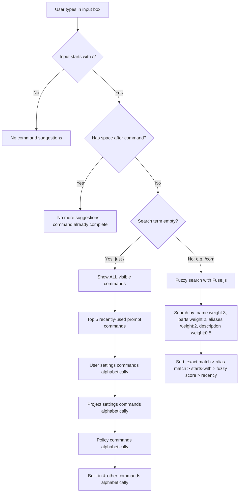

# How Claude Code's Slash Command Menu Works

> **Analysis model:** Claude Opus 4.6 (`claude-opus-4-6`) via Claude Code CLI (subscription)\
> **Date:** 2026-02-07\
> **Source:** Claude Code npm package, unminified with webcrack + prettier (webcrack names its output `deobfuscated.js` by convention, but the code is minified, not obfuscated)

## Table of Contents

1. [The Autocomplete Pipeline](#the-autocomplete-pipeline)
2. [When You Type Just /](#when-you-type-just-)
3. [When You Type /com (Partial Match)](#when-you-type-com-partial-match)
4. [Recency Scoring](#recency-scoring)
5. [Suggestion Item Shape](#suggestion-item-shape)
6. [Keybindings for Autocomplete](#keybindings-for-autocomplete)
7. [Full List of Slash Commands](#full-list-of-slash-commands)
8. [Command Registry Architecture](#command-registry-architecture)
9. [Key Constants](#key-constants)

---

## The Autocomplete Pipeline

When you type `/` in the Claude Code input, an **autocomplete dropdown** appears showing available commands. Here's exactly how it works:

**Source:** `deobfuscated.js:668215` (function `WmA` → renamed `getCommandSuggestions`)



---

## When You Type Just `/`

All **visible** (non-hidden) commands are shown, sorted in this order:

1. **Top 5 recently-used prompt commands** — Sorted by recency score (exponential decay, 7-day half-life)
2. **User settings commands** — From `~/.claude/commands/` (alphabetical)
3. **Project settings commands** — From `.claude/commands/` (alphabetical)
4. **Policy settings commands** — (alphabetical)
5. **Built-in and other commands** — compact, clear, context, etc. (alphabetical)

---

## When You Type `/com` (Partial Match)

**Fuse.js** fuzzy search kicks in with these weights:

| Search Field | Weight | Example |
|-------------|--------|---------|
| `commandName` | 3 | "compact" matches "/compact" |
| `partKey` (hyphenated parts) | 2 | "review" matches "/review-pr" |
| `aliasKey` | 2 | "reset" matches "/clear" (alias) |
| `descriptionKey` | 0.5 | "summary" matches "/compact" (description mentions it) |

Results are sorted by:
1. Exact name match
2. Exact alias match
3. Name starts with search term
4. Alias starts with search term
5. Fuzzy score (threshold: 0.3)
6. Recency score (tiebreaker)

---

## Recency Scoring

**Source:** `deobfuscated.js:466951`

```js
function getRecencyScore(commandName) {
  let usage = getSettings().skillUsage?.[commandName];
  if (!usage) return 0;
  let daysSinceLastUse = (Date.now() - usage.lastUsedAt) / 86400000;
  let decayFactor = Math.pow(0.5, daysSinceLastUse / 7); // half-life = 7 days
  return usage.usageCount * Math.max(decayFactor, 0.1);
}
```

- Each command's usage is tracked: `{ usageCount, lastUsedAt }`
- Score = `usageCount * decay` where decay halves every 7 days
- Minimum decay factor: 0.1 (commands never fully disappear)

---

## Suggestion Item Shape

```js
{
  id: "compact:local",           // unique identifier
  displayText: "/compact",       // what you see
  description: "Clear conversation history but keep a summary in context...",
  metadata: compactCommandObject // the full command object
}
```

---

## Keybindings for Autocomplete

| Key | Action |
|-----|--------|
| `Tab` | Accept selected suggestion |
| `Escape` | Dismiss autocomplete |
| `Up` / `Ctrl+P` | Previous suggestion |
| `Down` / `Ctrl+N` | Next suggestion |
| `Right Arrow` | Accept ghost text (tab completion) |

---

## Full List of Slash Commands

The complete list of commands is built from multiple sources. To get the **full list at runtime**, type `/` in Claude Code and scroll through the menu.

### Source Categories

| Source | Location | How Loaded |
|--------|----------|------------|
| **Built-in** | Hardcoded in `QbA` array (line 629929) | Always available |
| **Bundled skills** | Shipped with Claude Code | `loadSkillDirectories()` |
| **User skills** | `~/.claude/commands/*.md` | `loadSkillDirectories()` |
| **Project skills** | `.claude/commands/*.md` | `loadSkillDirectories()` |
| **Plugin skills** | From installed plugins | `loadSkillDirectories()` |
| **MCP commands** | From MCP server connections | `loadMcpCommands()` |
| **Policy commands** | From organization policies | `loadPolicyCommands()` |
| **Remote commands** | From remote/paired sessions | `getRemoteCommands()` |

### Known Built-in Commands

The built-in registry (`QbA` at line 629929) contains 60+ command objects. Based on the code analysis, the known built-in commands include:

- `/compact` — Clear conversation history but keep a summary in context
- `/clear` (aliases: `reset`, `new`) — Clear conversation history and free up context
- `/context` — Show current context usage / Visualize context as colored grid
- `/help` — Show help
- `/exit` — Exit Claude Code
- `/resume` — Resume a previous conversation
- `/copy` — Copy last response
- And many more (the full list depends on feature flags, platform, and enabled integrations)

Commands can also be **hidden** (`isHidden: true`) — these exist but don't appear in the autocomplete menu. They're still invocable if you type the full name.

---

## Command Registry Architecture

Commands are collected from 8 sources (bundled skills, user/project commands, MCP, plugins, policies, built-ins, remote) and merged into a single list filtered by `cmd.isEnabled()`. Commands with `isHidden: true` are callable but don't appear in the autocomplete menu.

See [skill/REFERENCE.md](../../skill/REFERENCE.md#command-registry-architecture) for the full registry breakdown.

---

## Key Constants

| Constant | Value | Purpose |
|----------|-------|---------|
| Fuse.js threshold | 0.3 | Fuzzy match threshold for command search |
| Recency half-life | 7 days | How quickly command recency decays |
| Max recent commands | 5 | Top recently-used commands shown |
