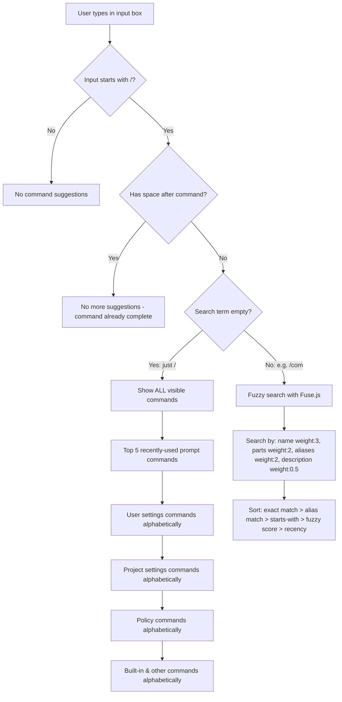

# How Claude Code's Slash Command Menu Works

> **Analysis model:** Claude Fable 5 (`claude-fable-5`) via Claude Code CLI\
> **Date:** 2026-07-04\
> **Source:** Claude Code v2.1.201, extracted from the Bun standalone binary, unminified with webcrack (`--no-jsx`) + prettier\
> **Annotated source:** Reuses code extracted in [`compact-annotated.js`](../compact/compact-annotated.js) (command registry, dispatch, autocomplete)

> **What changed since 2.1.34:** The Fuse.js search gained two "display" keys (`displayName` weight 2, `displayPartKey` weight 1) to handle namespaced skill/plugin commands whose shown name differs from their internal name. Recency scoring is unchanged (7-day half-life). The bigger shift is in the registry: many former built-in commands are now **bundled skills** — `/code-review` and `/simplify` no longer exist as built-in command objects (only `/review` does), and clicking a menu item now **fills the prompt** rather than executing immediately. See [How this evolved](#how-this-evolved-since-2134).

## Table of Contents

1. [The Autocomplete Pipeline](#the-autocomplete-pipeline)
2. [When You Type Just /](#when-you-type-just-)
3. [When You Type /com (Partial Match)](#when-you-type-com-partial-match)
4. [Recency Scoring](#recency-scoring)
5. [Suggestion Item Shape](#suggestion-item-shape)
6. [Keybindings for Autocomplete](#keybindings-for-autocomplete)
7. [Full List of Slash Commands](#full-list-of-slash-commands)
8. [Command Registry Architecture](#command-registry-architecture)
9. [Key Constants](#key-constants)

---

## The Autocomplete Pipeline

When you type `/` in the Claude Code input, an **autocomplete dropdown** appears showing available commands. Here's exactly how it works:

**Source:** `deobfuscated.js:668215` (function `WmA` → renamed `getCommandSuggestions`)


```mermaid
flowchart TD
    A[User types in input box] --> B{Input starts with /?}
    B -->|No| C[No command suggestions]
    B -->|Yes| D{Has space after command?}
    D -->|Yes| E[No more suggestions - command already complete]
    D -->|No| F{Search term empty?}
    F -->|Yes: just /| G[Show ALL visible commands]
    F -->|No: e.g. /com| H[Fuzzy search with Fuse.js]

    G --> G1[Top 5 recently-used prompt commands]
    G1 --> G2[User settings commands alphabetically]
    G2 --> G3[Project settings commands alphabetically]
    G3 --> G4[Policy commands alphabetically]
    G4 --> G5[Built-in & other commands alphabetically]

    H --> H1[Search by: name weight:3, parts weight:2, aliases weight:2, description weight:0.5]
    H1 --> H2[Sort: exact match > alias match > starts-with > fuzzy score > recency]
```

---

## When You Type Just `/`

All **visible** (non-hidden) commands are shown, sorted in this order:

1. **Top 5 recently-used prompt commands** — Sorted by recency score (exponential decay, 7-day half-life)
2. **User settings commands** — From `~/.claude/commands/` (alphabetical)
3. **Project settings commands** — From `.claude/commands/` (alphabetical)
4. **Policy settings commands** — (alphabetical)
5. **Built-in and other commands** — compact, clear, context, etc. (alphabetical)

---

## When You Type `/com` (Partial Match)

**Fuse.js** fuzzy search kicks in with these weights (`deobfuscated.js:827060`, threshold `0.3`, `location: 0`, `distance: 100`):

| Search Field | Weight | Example |
|-------------|--------|---------|
| `commandName` | 3 | "compact" matches "/compact" |
| `displayName` | 2 | **new** — the shown name (differs from internal name for namespaced skill/plugin commands) |
| `partKey` (hyphenated parts) | 2 | "review" matches "/review-pr" |
| `aliasKey` | 2 | "reset" matches "/clear" (alias) |
| `displayPartKey` | 1 | **new** — hyphenated parts of the display name |
| `descriptionKey` | 0.5 | "summary" matches "/compact" (description mentions it) |

The two `display*` keys were added because a growing share of commands are skills and plugin commands whose menu label (e.g. `plugin:skill`) is not the same string as their internal `commandName`. Results are sorted by:
1. Exact name match
2. Exact alias match
3. Name starts with search term
4. Alias starts with search term
5. Fuzzy score (threshold: 0.3)
6. Recency score (tiebreaker)

---

## Recency Scoring

**Source:** `deobfuscated.js:427625-427636` — unchanged algorithm from 2.1.34:

```js
function getRecencyScore(usage) {
  if (!usage) return 0;
  let daysSinceLastUse = (Date.now() - usage.lastUsedAt) / 86400000;
  let decayFactor = Math.pow(0.5, daysSinceLastUse / 7); // half-life = 7 days
  return usage.usageCount * Math.max(decayFactor, 0.1);
}
```

- Each command's usage is tracked: `{ usageCount, lastUsedAt }`
- Score = `usageCount * decay` where decay halves every 7 days
- Minimum decay factor: 0.1 (commands never fully disappear)

(There is a second, structurally identical decay at `deobfuscated.js:666925/666953` used elsewhere with a `q7l`-day half-life constant rather than a hardcoded 7 — worth noting if you're re-locating this, since the two look alike.)

---

## Suggestion Item Shape

```js
{
  id: "compact:local",           // unique identifier
  displayText: "/compact",       // what you see
  description: "Clear conversation history but keep a summary in context...",
  metadata: compactCommandObject // the full command object
}
```

---

## Keybindings for Autocomplete

| Key | Action |
|-----|--------|
| `Tab` | Accept selected suggestion |
| `Escape` | Dismiss autocomplete |
| `Up` / `Ctrl+P` | Previous suggestion |
| `Down` / `Ctrl+N` | Next suggestion |
| `Right Arrow` | Accept ghost text (tab completion) |

---

## Full List of Slash Commands

The complete list of commands is built from multiple sources. To get the **full list at runtime**, type `/` in Claude Code and scroll through the menu.

### Source Categories

| Source | Location | How Loaded |
|--------|----------|------------|
| **Built-in** | Hardcoded in `QbA` array (line 629929) | Always available |
| **Bundled skills** | Shipped with Claude Code | `loadSkillDirectories()` |
| **User skills** | `~/.claude/commands/*.md` | `loadSkillDirectories()` |
| **Project skills** | `.claude/commands/*.md` | `loadSkillDirectories()` |
| **Plugin skills** | From installed plugins | `loadSkillDirectories()` |
| **MCP commands** | From MCP server connections | `loadMcpCommands()` |
| **Policy commands** | From organization policies | `loadPolicyCommands()` |
| **Remote commands** | From remote/paired sessions | `getRemoteCommands()` |

### Known Built-in Commands

The built-in registry (`QbA` at line 629929) contains 60+ command objects. Based on the code analysis, the known built-in commands include:

- `/compact` — Clear conversation history but keep a summary in context
- `/clear` (aliases: `reset`, `new`) — Clear conversation history and free up context
- `/context` — Show current context usage / Visualize context as colored grid
- `/help` — Show help
- `/exit` — Exit Claude Code
- `/resume` — Resume a previous conversation
- `/copy` — Copy last response
- And many more (the full list depends on feature flags, platform, and enabled integrations)

Commands can also be **hidden** (`isHidden: true`) — these exist but don't appear in the autocomplete menu. They're still invocable if you type the full name.

### Commands that became skills

A number of things that read like built-in commands are now **bundled skills** loaded from `SKILL.md`, not entries in the built-in registry. Verified in 2.1.201 source: `name: "code-review"` and `name: "simplify"` do **not** exist as command objects — only `name: "review"` (the GitHub-PR review) survives as a built-in. `code-review` and `simplify` appear only as skill-name strings. This tracks the changelog history: `/simplify` was renamed `/code-review` (2.1.147), then `/simplify` came back as a separate cleanup-only skill (2.1.152), and both settled as skills rather than hardcoded commands. The practical upshot: the built-in registry shrank as the skills system absorbed feature-commands (see the [Skills deep dive](../skills/)).

---

## Command Registry Architecture

Commands are collected from 8 sources (bundled skills, user/project commands, MCP, plugins, policies, built-ins, remote) and merged into a single list filtered by `cmd.isEnabled()`. Commands with `isHidden: true` are callable but don't appear in the autocomplete menu.

See [skill/REFERENCE.md](../../skill/REFERENCE.md#command-registry-architecture) for the full registry breakdown.

---

## Key Constants

| Constant | Value | Purpose |
|----------|-------|---------|
| Fuse.js threshold | 0.3 | Fuzzy match threshold for command search |
| Recency half-life | 7 days | How quickly command recency decays |
| Min decay factor | 0.1 | Floor so used commands never fully disappear |
| Max recent commands | 5 | Top recently-used commands shown |

---

## How this evolved since 2.1.34

| Change | Detail |
|--------|--------|
| **Fuse keys expanded** | Added `displayName` (weight 2) and `displayPartKey` (weight 1) so namespaced skill/plugin commands match on their shown label, not just their internal name. Weights otherwise unchanged; threshold still 0.3. |
| **Recency unchanged** | `usageCount × max(0.5^(days/7), 0.1)` — identical. |
| **Feature-commands became skills** | `/code-review` and `/simplify` are bundled skills now, not built-ins; only `/review` remains a built-in command object. The built-in registry shrank as skills absorbed feature-commands. |
| **Click-to-fill** | Clicking a slash command in the menu fills the prompt input instead of executing immediately (changelog 2.1.162) — a deliberate guard against accidentally firing a command with one click. |
| **More registry sources** | Plugin skills, policy commands, and remote/paired-session commands are all first-class sources in the merge now (see [Command Registry Architecture](#command-registry-architecture)). |

The direction: the menu stopped being a fixed list of hardcoded commands and became a ranking surface over a heterogeneous, mostly-skill-driven registry — which is why the search had to learn about display names and why clicking got safer.
