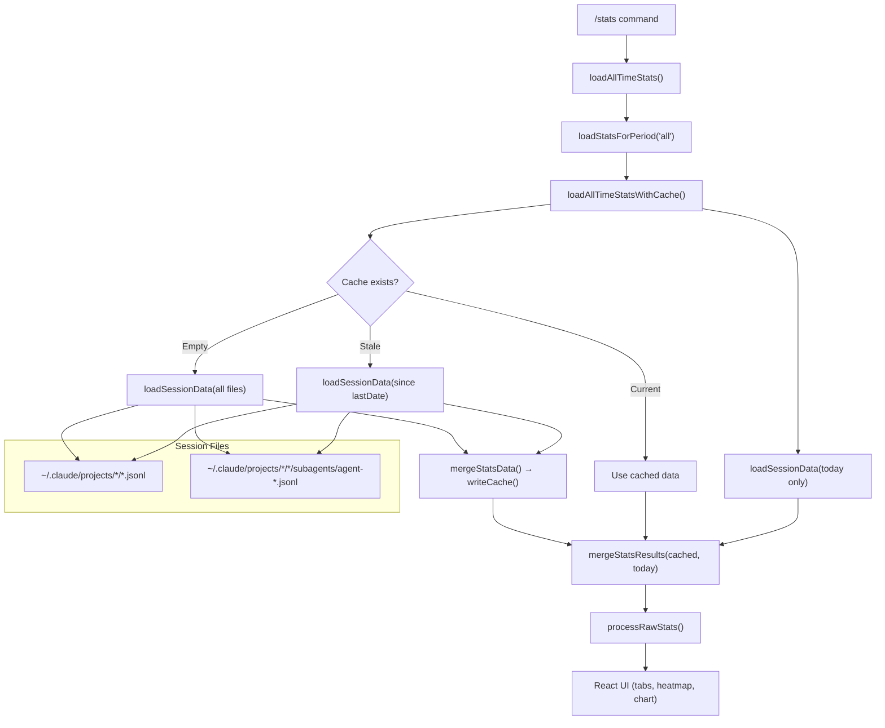
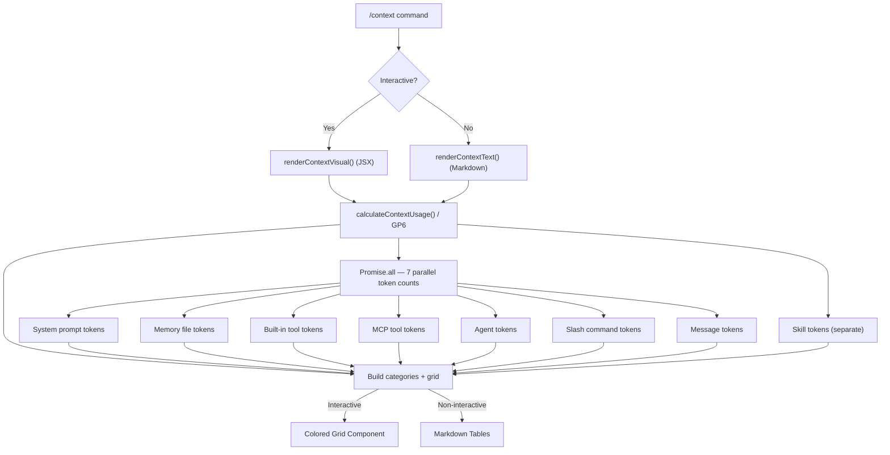

# /stats and /context Commands — Deep Dive

**Source:** Claude Code v2.1.34 (`deobfuscated.js`, 712,643 lines)
**Date:** 2026-02-07
**Annotated files:** `stats-annotated.js`, `context-annotated.js`

---

## Table of Contents

1. [Overview](#overview)
2. [/stats Command](#stats-command)
3. [/context Command](#context-command)
4. [Architecture Diagrams](#architecture-diagrams)
5. [Key Findings](#key-findings)
6. [Appendix: Token Comparison Tables](#appendix-token-comparison-tables)

---

## Overview

Both `/stats` and `/context` are **read-only introspection commands** — they surface internal data about Claude Code usage without making any API calls to Claude. Neither command sends prompts to the LLM.

| Property | `/stats` | `/context` |
|----------|----------|------------|
| Command type | `local-jsx` | `local-jsx` (interactive) + `local` (non-interactive) |
| Makes LLM calls | No | No |
| Reads from disk | Yes (session JSONL files + cache) | No (uses in-memory state) |
| Has caching | Yes (stats-cache.json) | No |
| React components | Yes (tabbed dialog) | Yes (colored grid) |
| Keyboard shortcuts | Tab, r, Ctrl+S, Esc | None (display-only) |
| Non-interactive support | No | Yes (markdown output) |

---

## /stats Command

### Command Definition

```
deobfuscated.js:627471-627487
```

```javascript
{
  type: "local-jsx",
  name: "stats",
  description: "Show your Claude Code usage statistics and activity",
  isEnabled: () => true,   // Always available
  isHidden: false,
}
```

### Data Pipeline

The data loading pipeline has four stages:

1. **Discover session files** — Scan `~/.claude/projects/*/` for `.jsonl` files (including `subagents/agent-*.jsonl`)
2. **Load and parse** — Read JSONL files in batches of 20, extract messages, skip sidechain entries
3. **Aggregate** — Group by date/hour/model, compute session durations, count tool calls
4. **Cache** — Store aggregated historical data in `stats-cache.json`, reload only new data

#### Session File Discovery (`deobfuscated.js:624125-624172`)

```
~/.claude/
  projects/
    <project-hash>/
      <session-id>.jsonl          ← main session files
      <session-id>/
        subagents/
          agent-<id>.jsonl        ← subagent session files
```

The `discoverSessionFiles()` function (`vbA`) walks this directory tree and returns all `.jsonl` file paths. It reads both main session files and subagent files.

#### Session Data Loading (`deobfuscated.js:623957-624124`)

The core loader `loadSessionData()` (`dP1`) processes files in **batches of 20** (parallelized with `Promise.all`):

1. **Date optimization**: Before reading file contents, checks the file's `mtime` against `fromDate` — if the file was last modified before the date range, it's skipped entirely
2. **JSONL parsing**: Each file is read via `readJsonlFile()` (`Y61`) which parses line-delimited JSON
3. **Entry filtering**: Only entries passing `isMessage()` (`eh`) are counted; `speculation-accept` entries have their `timeSavedMs` accumulated separately
4. **Sidechain filtering**: Messages with `isSidechain: true` are excluded from counts
5. **Model aggregation**: For each `assistant` message with `.message.usage`, token counts are accumulated by model name

The function skips entries from a hidden internal model ID (`aX1`).

#### Caching Strategy (`deobfuscated.js:624315-624359`)

The all-time stats use an incremental caching strategy:

```
┌─────────────────────────────────────────────────────┐
│  stats-cache.json (version: 2)                       │
│                                                       │
│  Contains: dailyActivity, dailyModelTokens,          │
│  modelUsage, totalSessions, totalMessages,           │
│  longestSession, firstSessionDate, hourCounts         │
│  lastComputedDate: "2025-02-06"                      │
└─────────────────────────────────────────────────────┘
```

Loading flow:
1. **Read cache** from `stats-cache.json` (`VbA`, `deobfuscated.js:623760`)
2. **Validate**: Check `version === 2`, verify array/number types
3. If cache is **empty**: Process ALL historical session files up to yesterday
4. If cache is **stale**: Process only files since `lastComputedDate + 1` day
5. If cache is **current**: Use as-is
6. **Always** load today's data fresh (since the day is still in progress)
7. **Merge** cached data + today's data for final result

Cache writes use **atomic file operations** (`deobfuscated.js:623795-623822`):
- Write to temp file with random hex suffix
- `flush: true` to ensure data hits disk
- Atomic `rename()` to the real path
- `mode: 0o600` (owner-only read/write)
- Cleanup temp file on error

A **mutex lock** (`fbA`, `deobfuscated.js:623726-623738`) prevents concurrent cache operations using a promise-based lock pattern.

### Streak Calculation (`deobfuscated.js:624485-624545`)

Two streaks are computed:

| Streak | Algorithm |
|--------|-----------|
| **Current streak** | Count backwards from today; stop at first missing date |
| **Longest streak** | Scan all sorted active dates; find longest run of consecutive days (delta = 86400000ms) |

### Activity Heatmap (`deobfuscated.js:624591-624705`)

GitHub-style contribution graph using Unicode block characters:

| Level | Character | Condition |
|-------|-----------|-----------|
| 0 | `·` (gray) | No activity |
| 1 | `░` (colored) | > 0, < p25 |
| 2 | `▒` (colored) | >= p25 |
| 3 | `▓` (colored) | >= p50 |
| 4 | `█` (colored) | >= p75 |

Thresholds use **percentiles** computed from all non-zero daily message counts (`deobfuscated.js:624578-624590`).

Grid dimensions: 7 rows (days of week) × 10-52 columns (weeks), scaled to terminal width.

### Tokens Per Day Chart (`deobfuscated.js:627068-627128`)

Uses the `asciichart` library for a **stacked area chart** showing daily token usage broken down by the top 3 models. Chart height is 8 rows. Data is resampled to fit terminal width (20-52 data points).

Y-axis formatting: values shown as raw, `Xk`, or `X.XM` depending on magnitude.

### Fun Facts (`deobfuscated.js:626719-626748`)

The Overview tab shows a randomly selected "fun fact" comparing your usage to known references:

- **Token comparisons**: 24 classic books from "The Little Prince" (22k tokens) to "War and Peace" (730k tokens) — see [Appendix](#appendix-token-comparison-tables)
- **Duration comparisons**: 10 activities from "a TED talk" (18 min) to "a full night of sleep" (480 min)

A random applicable fact is selected each time (e.g., "You've used ~3x more tokens than Moby-Dick").

### UI Components

The stats dialog is a React/Ink component with:

| Component | Location | Purpose |
|-----------|----------|---------|
| `StatsDialogWrapper` (`Ewq`) | `deobfuscated.js:625832-625875` | Suspense wrapper, loads data |
| `StatsDialog` (`k4z`) | `deobfuscated.js:625876-626176` | Main dialog with tabs, keybindings |
| `DateRangePicker` (`kwq`) | `deobfuscated.js:626184-626259` | Shows "All time · Last 7 days · Last 30 days" |
| `OverviewTab` (`R4z`) | `deobfuscated.js:626261-626718` | Heatmap + metrics + fun fact |
| `ModelsTab` (`S4z`) | `deobfuscated.js:626749-626925` | Chart + scrollable model list |
| `ModelCard` (`Nwq`) | `deobfuscated.js:626954-627067` | Per-model token breakdown |

Key bindings:

| Key | Action |
|-----|--------|
| `Esc` / `Ctrl+C` / `Ctrl+D` | Close dialog |
| `Tab` | Toggle between Overview and Models tabs |
| `r` | Cycle time period: all → 7d → 30d → all |
| `Ctrl+S` | Copy stats to clipboard (macOS only, `E9()` check) |
| `↑` / `↓` | Scroll model list (Models tab, when > 4 models) |

The Models tab paginates models in groups of 4, displayed in a 2×2 grid layout.

### Copy to Clipboard (`deobfuscated.js:627157-627279`)

When `Ctrl+S` is pressed (macOS only), the current tab's data is formatted as styled text (with chalk ANSI codes) and copied to clipboard. A "/stats" suffix is appended at the end of the last line.

---

## /context Command

### Command Definitions

Two variants are registered (`deobfuscated.js:563987-564021`):

| Variant | Type | Visible when | Purpose |
|---------|------|-------------|---------|
| `I6q` | `local-jsx` | Interactive mode | Colored grid visualization |
| `x6q` | `local` | Non-interactive mode | Markdown text output |

Only one is visible at a time — `q4()` (isNonInteractive) determines which is shown/hidden.

### Core Calculator: `GP6` (`deobfuscated.js:539032-539280`)

This is the most important function — it computes token usage breakdown for the entire context window. It does **not** make API calls to Claude; instead it estimates token counts locally.

#### Token Counting Pipeline

Seven independent token counting operations run **in parallel** via `Promise.all`:

| Function | Counts | Source |
|----------|--------|--------|
| `vQY(systemPromptConfig)` | System prompt tokens | Built system prompt text |
| `EQY()` | Memory file tokens (CLAUDE.md etc.) | Memory files on disk |
| `kQY(tools, perm, agents, model, msgs)` | Built-in tool definition tokens | Tool schemas |
| `JU1(tools, perm, agents, model, msgs)` | MCP tool tokens (loaded + deferred) | MCP server tool definitions |
| `yQY(agentDefs)` | Custom agent tokens | Agent definition text |
| `LQY(tools, perm, agents)` | Slash command tokens | Command definitions |
| `CQY(messages)` | Conversation message tokens | Current messages |

After the parallel phase, `RQY` counts **skill tokens** separately.

#### Context Categories

The calculator builds a list of categories, each with a name, token count, and color:

| Category | Color | Notes |
|----------|-------|-------|
| System prompt | `promptBorder` | Base system prompt text |
| System tools | `inactive` | Built-in tool schemas minus skill tokens |
| MCP tools | `cyan_FOR_SUBAGENTS_ONLY` | Loaded MCP tool definitions |
| MCP tools (deferred) | `inactive` | MCP tools not yet loaded (deferred loading) |
| System tools (deferred) | `inactive` | Built-in tools not yet loaded |
| Custom agents | `permission` | Agent definition text |
| Memory files | `claude` | CLAUDE.md and other memory files |
| Skills | `warning` | Skill definition text |
| Messages | `purple_FOR_SUBAGENTS_ONLY` | Conversation messages |
| Autocompact buffer | `inactive` | Reserved space before autocompact triggers |
| Compact buffer | `inactive` | Reserved space when compact (not autocompact) is used |
| Free space | `promptBorder` | Remaining context window |

**Deferred categories** are displayed in the UI but excluded from consumed token calculations.

#### Buffer Calculation

Two modes:

1. **Autocompact enabled** (default): Buffer = `contextWindow - autocompactThreshold`. The `autocompactThreshold` is `getAutocompactThreshold(model) - 13000` (`sRA`). This reserves ~13k+ tokens as headroom before autocompact triggers.
2. **Autocompact disabled**: A fixed `3000` token (`tRA`) compact buffer is reserved.

#### Actual vs Estimated Tokens

The function attempts to use the **actual API usage data** from the last API response (`sz6`) for the total token count, rather than the locally estimated sum. This provides higher accuracy when API usage data is available.

```javascript
let apiUsage = getLastAPIUsage(internalMsgs ?? messages);
let displayTotal = (apiUsage
  ? apiUsage.input_tokens + apiUsage.cache_creation_input_tokens + apiUsage.cache_read_input_tokens
  : null) ?? consumedTokens;
```

### Visual Grid (`deobfuscated.js:562723-563416`)

The grid is a 2D array of colored squares rendered in the terminal. Grid dimensions adapt to context window size and terminal width:

| Context window | Terminal | Grid size |
|---------------|----------|-----------|
| >= 1M tokens | Wide (≥80) | 20 × 10 (200 squares) |
| >= 1M tokens | Narrow (<80) | 5 × 10 (50 squares) |
| < 1M tokens | Wide (≥80) | 10 × 10 (100 squares) |
| < 1M tokens | Narrow (<80) | 5 × 5 (25 squares) |

Each square represents a proportional slice of the context window. Categories are guaranteed at least 1 square (except free space which can be 0). The grid uses Unicode symbols:
- `⛁` — filled category square
- `⛶` — free space square
- `⛝` — buffer square

The grid is rendered left-to-right, top-to-bottom with content categories first, then free space, then buffer at the end.

### Markdown Output (`deobfuscated.js:563833-563966`)

For non-interactive mode, the command outputs structured markdown with:

1. **Header**: Model name, token count, percentage
2. **Category table**: All active categories with tokens and percentages
3. **MCP Tools table**: Tool name, server name, tokens
4. **Custom Agents table**: Agent type, source (Project/User/Local/Flag/Policy/Plugin/Built-in), tokens
5. **Memory Files table**: Type, path, tokens
6. **Skills table**: Skill name, source, tokens

---

## Architecture Diagrams

### /stats Data Flow



### /context Data Flow



---

## Key Findings

### 1. No LLM Calls

Neither command makes API calls to Claude. `/stats` reads from disk; `/context` uses locally cached token counts and in-memory state. This makes both commands fast and free.

### 2. Incremental Stats Cache

The `/stats` command's caching strategy is well-designed:
- Historical data (up to yesterday) is cached and only recomputed incrementally
- Today's data is always loaded fresh
- Cache version checking (`kV6 = 2`) enables format migrations
- Atomic writes prevent corruption
- A mutex lock prevents race conditions

### 3. File Modification Time Optimization

The session data loader (`dP1`) checks file `mtime` before reading contents. If a file's modification time is before the `fromDate`, it's skipped without parsing. This significantly speeds up incremental loads.

### 4. Deferred Tool Loading Awareness

The `/context` command distinguishes between **loaded** and **deferred** tools. Deferred tools (both MCP and built-in) are shown in the UI but excluded from the consumed token calculation. This gives an accurate picture of actual context usage vs. potential usage if all tools were loaded.

### 5. Autocompact Buffer is 13,000 Tokens

The autocompact buffer constant (`sRA = 13000`, `deobfuscated.js:533182`) reveals that Claude Code reserves 13k tokens as headroom before triggering autocompact. The compact buffer (when autocompact is off) is only 3k tokens (`tRA = 3000`, `deobfuscated.js:533185`).

### 6. Speculation Time Tracking

The stats loader tracks `totalSpeculationTimeSavedMs` from `speculation-accept` entries in session JSONL files. This measures time saved by speculative execution, though the value is not currently displayed in the stats UI (it's computed but only passed through in the data object).

### 7. Hidden Internal Model

Session entries from a specific model ID (`aX1`) are excluded from stats aggregation. This appears to be an internal/system model whose usage shouldn't be counted in user-facing statistics.

### 8. macOS-Only Clipboard

The copy-to-clipboard feature (`Ctrl+S`) is gated behind `E9()` (isMac check). This feature is not available on Linux or Windows.

---

## Appendix: Token Comparison Tables

### Book Token Counts (for fun facts)

| Book | Token Count |
|------|-------------|
| The Little Prince | 22,000 |
| The Old Man and the Sea | 35,000 |
| A Christmas Carol | 37,000 |
| Animal Farm | 39,000 |
| Fahrenheit 451 | 60,000 |
| The Great Gatsby | 62,000 |
| Slaughterhouse-Five | 64,000 |
| Brave New World | 83,000 |
| The Catcher in the Rye | 95,000 |
| Harry Potter and the Philosopher's Stone | 103,000 |
| The Hobbit | 123,000 |
| 1984 | 123,000 |
| To Kill a Mockingbird | 130,000 |
| Pride and Prejudice | 156,000 |
| Dune | 244,000 |
| Moby-Dick | 268,000 |
| Crime and Punishment | 274,000 |
| A Game of Thrones | 381,000 |
| Anna Karenina | 468,000 |
| Don Quixote | 520,000 |
| The Lord of the Rings | 576,000 |
| The Count of Monte Cristo | 603,000 |
| Les Misérables | 689,000 |
| War and Peace | 730,000 |

### Duration Comparisons (for fun facts)

| Activity | Minutes |
|----------|---------|
| A TED talk | 18 |
| An episode of The Office | 22 |
| Listening to Abbey Road | 47 |
| A yoga class | 60 |
| A World Cup soccer match | 90 |
| A half marathon (average time) | 120 |
| The movie Inception | 148 |
| Watching Titanic | 195 |
| A transatlantic flight | 420 |
| A full night of sleep | 480 |

### Context Category Colors

| Category | Theme Color Key | Grid Symbol |
|----------|----------------|-------------|
| System prompt | `promptBorder` | `⛁` |
| System tools | `inactive` | `⛁` |
| MCP tools | `cyan_FOR_SUBAGENTS_ONLY` | `⛁` |
| MCP tools (deferred) | `inactive` | — |
| System tools (deferred) | `inactive` | — |
| Custom agents | `permission` | `⛁` |
| Memory files | `claude` | `⛁` |
| Skills | `warning` | `⛁` |
| Messages | `purple_FOR_SUBAGENTS_ONLY` | `⛁` |
| Free space | `promptBorder` | `⛶` |
| Autocompact buffer | `inactive` | `⛝` |
| Compact buffer | `inactive` | `⛝` |
