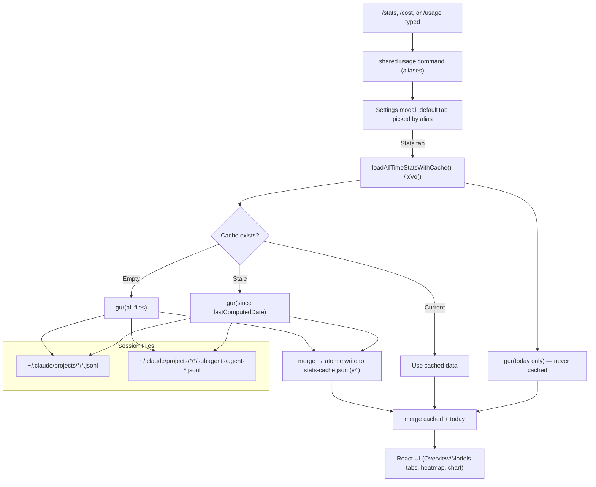
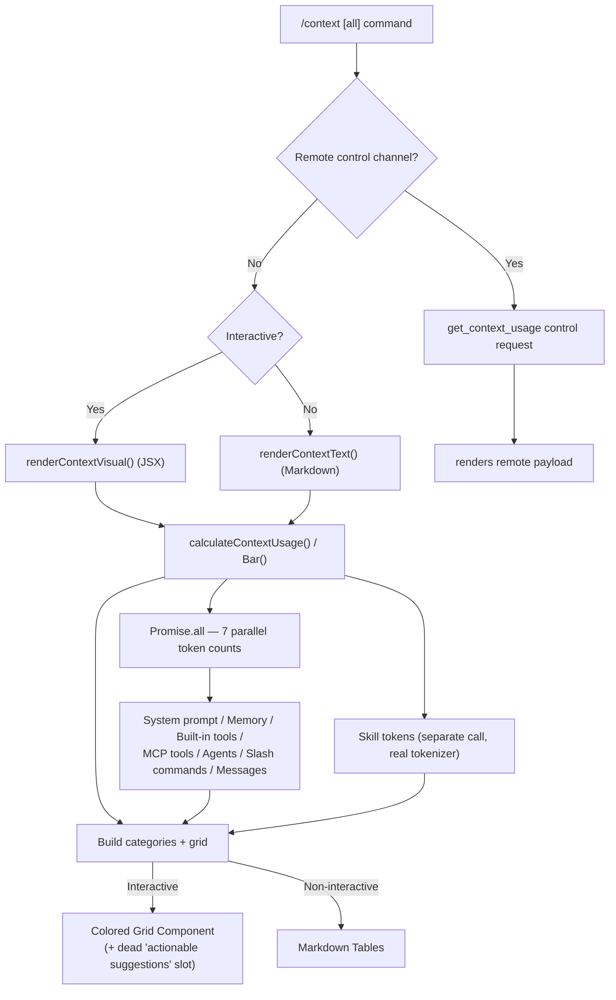

# `/stats`, `/usage`, and `/context` Commands — Deep Dive

> **Analysis model:** Claude Fable 5 (`claude-fable-5`) via Claude Code CLI\
> **Date:** 2026-07-04\
> **Source:** Claude Code v2.1.201, extracted from the Bun standalone binary, unminified with webcrack + prettier\
> **Annotated files:** `stats-annotated.js`, `context-annotated.js`\
> **Previous pass:** v2.1.34, npm `cli.js` (2026-02-07) — see [How this evolved since 2.1.34](#how-this-evolved-since-2134) for the diff

> **Note on the source:** As of v2.1.113 the npm package no longer ships `cli.js` — it is a thin installer that downloads a per-platform native binary. The JavaScript is now embedded in that Bun standalone executable and must be extracted from its module graph before unminifying. See [SKILL.md](../../skill/SKILL.md) for the current extraction procedure. Everything below is re-derived from that v2.1.201 extract; identifiers, line numbers, and behavior described are from `deobfuscated.js` at that version, not the original 2.1.34 pass.

---

## Table of Contents

1. [Overview](#overview)
2. [The stats/cost/usage alias reality](#the-statscostusage-alias-reality)
3. [`/usage` (incl. Stats tab)](#usage-incl-stats-tab)
4. [`/context` Command](#context-command)
5. [Architecture Diagrams](#architecture-diagrams)
6. [Key Findings](#key-findings)
7. [How this evolved since 2.1.34](#how-this-evolved-since-2134)
8. [Appendix: Token Comparison Tables](#appendix-token-comparison-tables)
9. [Reproducing this analysis](#reproducing-this-analysis)
10. [Attribution](#attribution)

---

## Overview

`/stats`, `/cost`, `/usage`, and `/context` are all **read-only introspection commands** — they surface internal data about Claude Code's own usage and context consumption without making any API calls to Claude. None of them send prompts to the LLM.

| Property | `/usage` (incl. Stats) | `/context` |
|----------|----------|------------|
| Command type | `local-jsx` (interactive) + `local` (non-interactive, gated by `mr()`) | `local-jsx` (interactive) + `local` (non-interactive, gated by `mr()`) |
| Makes LLM calls | No | No |
| Reads from disk | Yes (session JSONL files + `stats-cache.json`) | No (uses in-memory state) |
| Has caching | Yes (`stats-cache.json`, version 4) | No |
| Remote / thin-client aware | Yes (`thinClientDispatch: "control-request"`) | Yes (`thinClientDispatch: "control-request"`, `get_context_usage`) |
| React components | Yes (4-tab Settings dialog) | Yes (colored grid) |
| Keyboard shortcuts | `r` (cycle date range), `Ctrl+S` (copy — now cross-platform), `↑` (focus tabs) | None (display-only) |
| Non-interactive support | Yes (markdown/text output) | Yes (markdown output) |
| CLI arguments | — | `[all]` — expands collapsed detail sections |

---

## The stats/cost/usage alias reality

Read this before anything else, because it changes how the rest of this document should be read: **`/stats` was not removed, and it was not merged into `/usage`'s cost/billing logic.** All three surface names are aliases of a single command object:

```javascript
// deobfuscated.js:730166-730200
var usageJSXCommand = {
  type: "local-jsx",
  name: "usage",
  aliases: ["cost", "stats"],
  thinClientDispatch: "control-request",
  immediate: true,
  // ...
};
var usageTextCommand = {
  type: "local",
  name: "usage",
  aliases: ["cost", "stats"],
  supportsNonInteractive: true,
  isEnabled: () => isNonInteractive(),
  // ...
};
```

Typing `/stats`, `/cost`, or `/usage` all dispatch to the same handler, which opens **one Settings-style modal** (`deobfuscated.js:664446`) with four tabs — **Status, Config, Usage, Stats** — and picks the starting tab from whichever alias was typed:

```javascript
// deobfuscated.js:730018
defaultTab: aliasUsed === "stats" ? "Stats" : "Usage"
```

The **"Stats" tab** (`deobfuscated.js:664543-664548`) is the direct, functionally-unchanged continuation of what the v2.1.34 pass documented as the entire `/stats` command: the same heatmap, streaks, fun facts, and Overview/Models sub-tabs. The **"Usage" tab** (`deobfuscated.js:664533-664536`) shows session cost and plan/rate-limit usage — this is what `/cost` used to be alone. So: the old claim "`/stats` and `/cost` merged into `/usage`" is directionally correct, but the mechanism is **alias + `defaultTab` routing into a shared modal**, not a data merge — the Stats tab's data pipeline is untouched and still completely separate from the Usage tab's cost/limits data.

Both the jsx and text variants of `/usage` are gated by the same `mr()` (`!isInteractive()`) helper that gates `/context`'s two variants — this convention is consistent across both commands.

---

## `/usage` (incl. Stats tab)

### Command Definition

```
deobfuscated.js:730166-730200
```

See [the alias reality](#the-statscostusage-alias-reality) above for the full object. Key point: `isEnabled`/`isHidden` on the non-interactive variant are inverses of each other, driven by `mr()`.

### Settings Dialog Shell (`deobfuscated.js:664446-664565`, `rFe`)

Four tabs, in this order: **Status**, **Config**, **Usage**, **Stats**. Closing the dialog (Esc) fires `"Settings dialog dismissed"` (or `"Stats dialog dismissed"` from inside the Stats tab specifically) as a system message.

### Stats Tab Data Pipeline

The data loading pipeline is unchanged in shape from the 2.1.34 pass — four stages:

1. **Discover session files** — Scan `~/.claude/projects/*/` for `.jsonl` files (including `subagents/agent-*.jsonl`)
2. **Load and parse** — Read JSONL files in batches of 20, extract messages, skip sidechain entries
3. **Aggregate** — Group by date/hour/model, compute session durations, count tool calls
4. **Cache** — Store aggregated historical data in `stats-cache.json`, reload only new data

#### Session File Discovery (`deobfuscated.js:662630-662662`, `jYl`)

```
~/.claude/
  projects/
    <project-hash>/
      <session-id>.jsonl          ← main session files
      <session-id>/
        subagents/
          agent-<id>.jsonl        ← subagent session files
```

`jYl()` walks this tree and returns all `.jsonl` file paths — both main session files and subagent files. Unchanged from 2.1.34.

#### Raw Session Data Loader (`deobfuscated.js:662435-662629`, `gur`)

Processes files in **batches of 20** (parallelized with `Promise.all`), unchanged:

1. **Date optimization**: checks each file's `mtime` against `fromDate` before reading contents; skips entirely if the file predates the range
2. **JSONL parsing**: reads and filters entries via a message-type predicate
3. **Sidechain filtering**: subagent-path files still contribute to `modelUsage`/token aggregation, but are excluded from `sessionStats`/streak/heatmap counts
4. **Model aggregation**: for each `assistant` message with `.message.usage`, token counts are accumulated by model name, skipping a hidden/internal model sentinel

**Removed since 2.1.34**: the loader no longer reads `speculation-accept` entries or accumulates `totalSpeculationTimeSavedMs` at all. A bare `...{}` spread at the end of `gur()`'s return object (`deobfuscated.js:662627`) is the dead remnant of where that field used to be spliced in. Grepping the entire v2.1.201 bundle for `"speculation-accept"` or `"SpeculationTimeSaved"` returns zero hits — this is a real removal, not a rename.

#### Caching Strategy (`deobfuscated.js:661456-661548`)

```
┌─────────────────────────────────────────────────────┐
│  stats-cache.json (version: 4)         ← was 2       │
│                                                       │
│  Contains: dailyActivity, dailyModelTokens,          │
│  modelUsage, totalSessions, totalMessages,           │
│  longestSession, firstSessionDate, hourCounts,       │
│  shotDistribution                       ← NEW field  │
│  lastComputedDate: "2026-07-03"                      │
└─────────────────────────────────────────────────────┘
```

Loading flow (unchanged in shape, `deobfuscated.js:661510-661534`, `wYl`):
1. **Read cache** from `stats-cache.json`
2. **Validate/migrate**: version constant is now **4** (`rJe`, up from 2), with a minimum migratable version of **1** (`hJf`). If the stored version differs from 4, `_Jf()` attempts a field-by-field migration and re-persists; if migration fails or the structure is invalid, an empty cache is returned instead of crashing.
3. If cache is **empty**: process ALL historical session files up to yesterday
4. If cache is **stale**: process only files since `lastComputedDate + 1` day
5. If cache is **current**: use as-is
6. **Always** load today's data fresh (since the day is still in progress) — this is never persisted to the cache
7. **Merge** cached data + today's data for the final result

Cache writes (`deobfuscated.js:661535-661548`, `Ttn`) are **atomic**: JSON-stringify with 2-space indent, `atomicWrite(path, data, 384)` — mode `384` decimal = `0o600` (owner-only read/write). A promise-chained **in-process mutex** (`deobfuscated.js:661456-661470`, `vYl`) serializes read-modify-write cycles — note this is an in-process lock, not a cross-process lockfile, so it only protects against concurrent operations within the same CLI process.

**New, unused field**: the cache schema now includes a `shotDistribution` field (`deobfuscated.js:661486`, `661507`) in both the empty-cache shape and the migrated shape, but nothing in the bundle populates or reads it. Treat it as a reserved/half-wired field for a not-yet-shipped feature.

### Streak Calculation (`deobfuscated.js:662900+`, `GYl`)

Unchanged:

| Streak | Algorithm |
|--------|-----------|
| **Current streak** | Count backwards from today; stop at first missing date |
| **Longest streak** | Scan all sorted active dates; find longest run of consecutive days (delta = 86400000ms) |

### Activity Heatmap (`deobfuscated.js:661686-661752`, `TVo`)

GitHub-style contribution graph, unchanged:

| Level | Character | Condition |
|-------|-----------|-----------|
| 0 | `·` (gray) | No activity |
| 1 | `░` (colored) | > 0, < p25 |
| 2 | `▒` (colored) | >= p25 |
| 3 | `▓` (colored) | >= p50 |
| 4 | `█` (colored) | >= p75 |

Thresholds use percentiles computed from all non-zero daily message counts (`deobfuscated.js:661675-661685`, `bJf`). Grid: 7 rows (days of week) × up to 52 columns (weeks), scaled to terminal width. All glyphs render in the brand color `#da7756`.

### Fun Facts (`deobfuscated.js:664341-664444`)

Unchanged and byte-for-byte identical to the 2.1.34 pass:

- **Token comparisons**: 24 classic books from "The Little Prince" (22k tokens) to "War and Peace" (730k tokens) — see [Appendix](#appendix-token-comparison-tables)
- **Duration comparisons**: 10 activities from "a TED talk" (18 min) to "a full night of sleep" (480 min)

### Tabs and Key Bindings

The Stats tab body (`deobfuscated.js:663086-663394`, `KJf`) has two sub-tabs: **Overview** (`deobfuscated.js:663300`) and **Models** (`deobfuscated.js:663321`) — same two names as 2.1.34.

Key handling (`deobfuscated.js:663178-663193`):

| Key | Action |
|-----|--------|
| `↑` | Focus the outer tab header (Status/Config/Usage/Stats) instead of the inner Overview/Models tabs |
| `r` | Cycle date range: `all → 7d → 30d → all` |
| `Ctrl+S` | Copy current tab as a screenshot to the clipboard — see below |

Footer hint text is now literally `"↓ stats · ↑ tabs · r to cycle dates · ctrl+s to copy"` (`deobfuscated.js:663360-663369`) — there is no `Tab` key mentioned and no macOS-only qualifier in the string itself, because the copy path is no longer macOS-only.

### Copy to Clipboard (`Ctrl+S`) — no longer macOS-only

The v2.1.34 pass documented this as gated behind an `isMac()` check. That gate is **gone**. The current implementation (`deobfuscated.js:664193-664220` builds the export text; `deobfuscated.js:662294-662388` renders it to a PNG screenshot and pushes it to the clipboard) branches per platform:

| Platform | Mechanism |
|----------|-----------|
| macOS | `osascript -e 'set the clipboard to (read (POSIX file ...) as «class PNGf»)'` |
| Linux | `xclip -selection clipboard -t image/png -i <file>` — **new** |
| Windows | `powershell -Command "[System.Windows.Forms.Clipboard]::SetImage(...)"` — **new** |
| other | Returns `{ success: false, message: "Screenshot to clipboard is not supported on <platform>" }` |

A right-aligned `/stats` watermark is still appended to the exported text (70 chars wide for Overview, 80 for Models) before rendering.

---

## `/context` Command

### Command Definitions (`deobfuscated.js:666089-666119`)

Two variants, same `mr()` gate as `/usage`:

| Variant | Type | Visible when | Purpose |
|---------|------|-------------|---------|
| `OVo` | `local-jsx` | Interactive mode | Colored grid visualization |
| `NVo` | `local` | Non-interactive mode | Markdown text output |

**New**: `argumentHint: "[all]"` on the jsx variant, and `thinClientDispatch: "control-request"` on both. Neither existed in the 2.1.34 pass.

### `/context` vs `/context all` — new in this build

The jsx entry point (`deobfuscated.js:665985-666023`) now inspects its argument string:

```javascript
let collapseDetailSections =
  isInteractive() && argString.trim().toLowerCase() !== "all";
```

By default, `/context` collapses the per-category detail tables (MCP tools, memory files, skills, agents). `/context all` expands them. This argument did not exist in the 2.1.34 pass.

### Remote support — new in this build

If a control channel is attached (`ql() !== null`) and the channel supports it, the jsx variant sends a `get_context_usage` control request instead of computing locally, then renders the same grid component against the remote payload — falling back to the local calculation otherwise (`deobfuscated.js:665985-666010` region). This is part of the same thin-client/remote-control plumbing referenced by `thinClientDispatch: "control-request"` on the command definition.

### Core Calculator (`deobfuscated.js:621029-621324`, `Bar`)

This is still the most important function — it computes token usage breakdown for the entire context window locally, without an API call.

#### Token Counting Pipeline

Seven independent token-counting operations still run **in parallel** via `Promise.all` (`deobfuscated.js:621055-621077`) — same composition as 2.1.34, only the identifiers changed:

| Category | Result fields | Source function |
|----------|--------|--------|
| System prompt | `systemPromptTokens`, `systemPromptSections`, `redirectedContextTokens` | `YVf` |
| Memory (CLAUDE.md) | `claudeMdTokens`, `memoryFileDetails` | `XVf` |
| Built-in tools | `builtInToolTokens`, `deferredBuiltinDetails`, `deferredBuiltinTokens`, `systemToolDetails` | `JVf` |
| MCP tools | `mcpToolTokens`, `mcpToolDetails`, `deferredToolTokens` | `e9f` |
| Custom agents | `agentTokens`, `agentDetails` | `t9f` |
| Slash commands | `slashCommandTokens`, `commandInfo` | `QVf` |
| Messages / tool calls | full breakdown object | `s9f` |

After the parallel phase, **skills are still counted separately** via a dedicated call (`deobfuscated.js:621078`, `ZVf`), not part of the `Promise.all`. Per-skill tokens are computed with the same token-estimation helper (`Rf`) used for message/tool tokens — not a flat heuristic — with truncation modes (`priority` / `names-only`) driven by a model-context-window-derived budget.

#### Context Categories (`deobfuscated.js:621084-621181`)

Unchanged names and colors:

| Category | Color | Notes |
|----------|-------|-------|
| System prompt | `promptBorder` | Base system prompt text |
| System tools | `inactive` | Built-in tool schemas minus skill tokens |
| MCP tools | `cyan_FOR_SUBAGENTS_ONLY` | Loaded MCP tool definitions |
| MCP tools (deferred) | `inactive` | MCP tools not yet loaded |
| System tools (deferred) | `inactive` | Built-in tools not yet loaded |
| Custom agents | `permission` | Agent definition text |
| Memory files | `claude` | CLAUDE.md and other memory files |
| Skills | `warning` | Skill definition text |
| Messages | `purple_FOR_SUBAGENTS_ONLY` | Conversation messages |
| Autocompact buffer | `inactive` | Reserved space before autocompact triggers |
| Compact buffer | `inactive` | Reserved space when compact (not autocompact) is used |
| Free space | `promptBorder` | Remaining context window |

Deferred categories are still displayed but excluded from consumed-token calculations.

#### Buffer Calculation — unchanged exact constants

```javascript
// deobfuscated.js:619918-619919
var AUTOCOMPACT_BUFFER_TOKENS = 13000; // ZWl
var COMPACT_BUFFER_TOKENS = 3000;      // e5l
```

1. **Autocompact enabled** (default): buffer = `contextWindow - autocompactThreshold`, where `autocompactThreshold` reserves 13,000 tokens as headroom.
2. **Autocompact disabled**: a fixed 3,000-token compact buffer is reserved instead.

Both values are byte-identical to the 2.1.34 pass.

#### Actual vs Estimated Tokens — unchanged

The calculator still prefers **actual API usage** (`input_tokens + cache_creation_input_tokens + cache_read_input_tokens` from the most recent assistant message's usage block, `deobfuscated.js:621052-621054`) over the locally-estimated sum when that data is available, reconciling it into the "Messages" category total (`deobfuscated.js:621154-621159`).

### Visual Grid (`deobfuscated.js:665129-665337+`, `DVo`)

Grid dimensions adapt to context window size and terminal width — formula is unchanged:

| Context window | Terminal | Grid size |
|---------------|----------|-----------|
| >= 1M tokens | Wide (≥80) | 20 × 10 (200 squares) |
| >= 1M tokens | Narrow (<80) | 5 × 10 (50 squares) |
| < 1M tokens | Wide (≥80) | 10 × 10 (100 squares) |
| < 1M tokens | Narrow (<80) | 5 × 5 (25 squares) |

This formula didn't need to change for Sonnet-5-class models' native 1M context window: the window itself flows in through the existing generic resolution chain (`deobfuscated.js:620032-620087`, `A3`: env override → per-session settings → client-reported window → experiment override → model-declared default), and a model that declares a 1M-token default automatically lands in the `>=1M` grid branch with no `/context`-specific special-casing required.

**New grid glyph**: alongside the three documented in the 2.1.34 pass, there is now a fourth glyph for partially-filled squares (`deobfuscated.js:665797`):

- `⛁` — filled category square (fullness ≥ 0.7)
- `⛀` — **new** — partially-filled category square (fullness < 0.7)
- `⛶` — free space square
- `⛝` — buffer / deferred square

### "Actionable suggestions" — present as a slot, but currently a no-op

The interactive grid conditionally renders a suggestions component when not connected remotely (`deobfuscated.js:665266`):

```javascript
let suggestionsPanel = !isRemote && React.createElement(ContextSuggestions, {});
```

`ContextSuggestions` itself (`deobfuscated.js:665054-665057`, `CQf`) is a literal two-line stub:

```javascript
function ContextSuggestions() {
  return null;
}
```

It takes no props and unconditionally returns `null`. No separate "context-heavy tool" or "memory bloat" advisory logic was found wired to this slot anywhere in the bundle. If the changelog's ~2.1.74 "actionable suggestions" feature is real, it is either feature-flagged off with the flag check stripped from this build, or it was reverted — this render slot is the only surviving trace of it. This should be treated as **present-but-dead** rather than confirmed-working.

### Markdown Output (`deobfuscated.js:666055-666083`)

For non-interactive mode, the command outputs structured markdown — same table set as 2.1.34: header (model, tokens, percentage), category table, MCP Tools table, Custom Agents table (with source: Project/User/Local/Flag/Policy/Plugin/Built-in), Memory Files table, Skills table.

---

## Architecture Diagrams

### `/usage` → Stats tab data flow


```mermaid
graph TD
    A["/stats, /cost, or /usage typed"] --> B["shared usage command (aliases)"]
    B --> C["Settings modal, defaultTab picked by alias"]
    C -->|Stats tab| D["loadAllTimeStatsWithCache() / xVo()"]
    D --> E{"Cache exists?"}
    E -->|Empty| F["gur(all files)"]
    E -->|Stale| G["gur(since lastComputedDate)"]
    E -->|Current| H["Use cached data"]
    F --> I["merge → atomic write to stats-cache.json (v4)"]
    G --> I
    D --> J["gur(today only) — never cached"]
    I --> K["merge cached + today"]
    H --> K
    J --> K
    K --> L["React UI (Overview/Models tabs, heatmap, chart)"]

    subgraph "Session Files"
        N["~/.claude/projects/*/*.jsonl"]
        O["~/.claude/projects/*/*/subagents/agent-*.jsonl"]
    end

    F --> N
    F --> O
    G --> N
    G --> O
```

### `/context` Data Flow


```mermaid
graph TD
    A["/context [all] command"] --> B{"Remote control channel?"}
    B -->|Yes| C["get_context_usage control request"]
    B -->|No| D{"Interactive?"}
    D -->|Yes| E["renderContextVisual() (JSX)"]
    D -->|No| F["renderContextText() (Markdown)"]
    C --> G["<ContextGrid> renders remote payload"]
    E --> H["calculateContextUsage() / Bar()"]
    F --> H

    H --> I["Promise.all — 7 parallel token counts"]
    I --> J["System prompt / Memory / Built-in tools /<br>MCP tools / Agents / Slash commands / Messages"]
    H --> K["Skill tokens (separate call, real tokenizer)"]
    H --> L["Build categories + grid"]

    J --> L
    K --> L

    L -->|Interactive| M["Colored Grid Component<br>(+ dead 'actionable suggestions' slot)"]
    L -->|Non-interactive| N["Markdown Tables"]
```

---

## Key Findings

### 1. No LLM Calls

Neither `/usage` nor `/context` makes API calls to Claude. Both remain fast and free. Unchanged from 2.1.34.

### 2. `/stats`, `/cost`, and `/usage` are one command with three aliases, not three features

See [the alias reality](#the-statscostusage-alias-reality). This is the single most important structural finding of this pass — read it before trusting any external claim that "stats was removed" or "stats and cost merged into usage."

### 3. Stats Cache Version Bumped 2 → 4, With a Real Migration Path

`stats-cache.json`'s version constant is now 4 (was 2), with a documented minimum migratable version of 1 and an explicit migration function that upgrades old caches in place and logs the transition. This is a maturing-format signal, not a breaking change for existing users.

### 4. Speculative-Decoding Time Tracking Was Fully Removed

The 2.1.34 pass documented `totalSpeculationTimeSavedMs` as "computed but not displayed." As of 2.1.201 it isn't computed at all — the `speculation-accept` entry type is no longer read anywhere in the bundle, and a dead `...{}` spread marks where the field used to be spliced into the loader's return value.

### 5. Clipboard Copy (`Ctrl+S`) Is No Longer macOS-Only

The 2.1.34 pass documented this as gated behind an `isMac()` check. It now has working Linux (`xclip`) and Windows (PowerShell `Clipboard.SetImage`) branches alongside the original macOS `osascript` path.

### 6. Autocompact Buffer Is Still 13,000 Tokens, Compact Buffer Still 3,000

Both constants are byte-identical to the 2.1.34 pass (`deobfuscated.js:619918-619919`).

### 7. `/context`'s Grid Formula Didn't Need to Change for Native 1M-Context Models

The `>=1M tokens → 20×10 grid` branch already existed in 2.1.34 and simply fires whenever the generic model-window-resolution chain resolves a 1M-token default — which a Sonnet-5-class model does out of the box. No `/context`-specific code changed to "support" 1M windows; the support was already generic.

### 8. `/context`'s "Actionable Suggestions" Slot Renders, But Does Nothing

A UI slot for context-usage suggestions exists and is wired into the non-remote render path, but the component behind it is a two-line stub that always returns `null`. Anyone relying on a changelog entry that describes this feature as live should verify against the actual render output, not the changelog text.

### 9. `/context [all]` and Remote `/context` Are New

Both the collapse/expand argument and control-channel remote execution are new plumbing since 2.1.34, part of a broader thin-client/remote-control effort that also touches `/usage`.

---

## How this evolved since 2.1.34

| Area | v2.1.34 | v2.1.201 |
|------|---------|----------|
| Command surface | `/stats` (own `local-jsx` command), `/cost` documented separately | `/stats`, `/cost`, `/usage` are aliases of one command; Stats/Usage are tabs in a shared Settings modal |
| Stats cache version | 2 | 4, with migration from v1 |
| Stats cache extra field | — | `shotDistribution` (reserved, unpopulated) |
| Speculation time tracking | Computed, unused | Removed entirely (dead spread remnant only) |
| Clipboard copy platforms | macOS only | macOS, Linux (`xclip`), Windows (PowerShell) |
| `/context` arguments | None | `[all]` — expands collapsed detail sections |
| `/context` remote support | None found | `get_context_usage` control-request path for thin clients |
| Command dispatch metadata | — | `thinClientDispatch: "control-request"` on both `/usage` and `/context` jsx variants |
| Grid glyphs | `⛁` `⛶` `⛝` | + `⛀` for partial fullness |
| Autocompact/compact buffers | 13000 / 3000 | Unchanged |
| Grid size formula | 20×10 / 10×10 (+ narrow variants) | Unchanged (now regularly exercised by native-1M models) |
| Actionable suggestions (changelog ~2.1.74) | Not present in 2.1.34 source | Render slot exists, component is a hard-coded `return null` stub |
| Fun facts (books/durations) | 24 books, 10 durations | Byte-identical |
| Per-skill token counting | Present | Present, confirmed to use the same tokenizer estimator as messages/tools |

---

## Appendix: Token Comparison Tables

### Book Token Counts (for fun facts) — unchanged

| Book | Token Count |
|------|-------------|
| The Little Prince | 22,000 |
| The Old Man and the Sea | 35,000 |
| A Christmas Carol | 37,000 |
| Animal Farm | 39,000 |
| Fahrenheit 451 | 60,000 |
| The Great Gatsby | 62,000 |
| Slaughterhouse-Five | 64,000 |
| Brave New World | 83,000 |
| The Catcher in the Rye | 95,000 |
| Harry Potter and the Philosopher's Stone | 103,000 |
| The Hobbit | 123,000 |
| 1984 | 123,000 |
| To Kill a Mockingbird | 130,000 |
| Pride and Prejudice | 156,000 |
| Dune | 244,000 |
| Moby-Dick | 268,000 |
| Crime and Punishment | 274,000 |
| A Game of Thrones | 381,000 |
| Anna Karenina | 468,000 |
| Don Quixote | 520,000 |
| The Lord of the Rings | 576,000 |
| The Count of Monte Cristo | 603,000 |
| Les Misérables | 689,000 |
| War and Peace | 730,000 |

### Duration Comparisons (for fun facts) — unchanged

| Activity | Minutes |
|----------|---------|
| A TED talk | 18 |
| An episode of The Office | 22 |
| Listening to Abbey Road | 47 |
| A yoga class | 60 |
| A World Cup soccer match | 90 |
| A half marathon (average time) | 120 |
| The movie Inception | 148 |
| Watching Titanic | 195 |
| A transatlantic flight | 420 |
| A full night of sleep | 480 |

### Context Category Colors — unchanged

| Category | Theme Color Key | Grid Symbol |
|----------|----------------|-------------|
| System prompt | `promptBorder` | `⛁` / `⛀` |
| System tools | `inactive` | `⛁` / `⛀` |
| MCP tools | `cyan_FOR_SUBAGENTS_ONLY` | `⛁` / `⛀` |
| MCP tools (deferred) | `inactive` | `⛝` |
| System tools (deferred) | `inactive` | `⛝` |
| Custom agents | `permission` | `⛁` / `⛀` |
| Memory files | `claude` | `⛁` / `⛀` |
| Skills | `warning` | `⛁` / `⛀` |
| Messages | `purple_FOR_SUBAGENTS_ONLY` | `⛁` / `⛀` |
| Free space | `promptBorder` | `⛶` |
| Autocompact buffer | `inactive` | `⛝` |
| Compact buffer | `inactive` | `⛝` |

Any category square renders as `⛁` when ≥70% full, `⛀` when partially filled — the split is per-square, not per-category.

---

## Reproducing this analysis

This process can be applied to any Claude Code feature. The methodology is packaged as a reusable [Claude Code skill](../../skill/) with automation scripts — see the [root README](../../README.md#how-the-source-is-obtained) for the general process and [SKILL.md](../../skill/SKILL.md) for the full extraction pipeline, including the Bun-binary extraction procedure needed since v2.1.113.

---

## Attribution

### Tools used

| Tool | Author | Purpose |
|------|--------|---------------|
| [webcrack](https://github.com/j4k0xb/webcrack) | j4k0xb | Syntax unminification |
| [Prettier](https://github.com/prettier/prettier) | Prettier team | Code formatting |
| [bun-decompile](https://github.com/lafkpages/bun-decompile) | lafkpages | Understood Bun binary format |
| [humanify](https://github.com/jehna/humanify) | jehna | Adopted LLM rename technique |

### Prior art — others who reversed Claude Code

See the full list in [skill/REFERENCE.md](../../skill/REFERENCE.md#prior-art).

### Files produced

| File | What |
|------|------|
| `../webcrack-output/deobfuscated.js` | Full unminified CLI (965,378 lines) — not included in repo; reproduce via [How the source is obtained](../../README.md#how-the-source-is-obtained) |
| `stats-annotated.js` | Renamed extract covering the Stats tab, cache, heatmap, fun facts |
| `context-annotated.js` | Renamed extract covering `/context`'s calculator, grid, and markdown output |
